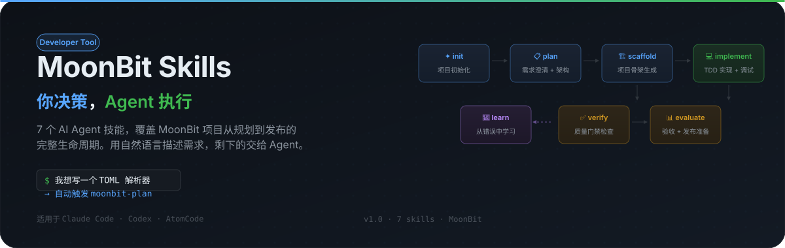

<p align="center">
  
</p>

# MoonBit Skills

面向 MoonBit 项目的 **Agent 技能套件与质量门禁**。

你负责做设计决策，Agent 负责把决策变成任务、代码和验证证据。仓库提供 **18 个核心技能**，另有一个 bootstrap 技能负责入口路由。

它不是 MoonBit 运行库，也不替代 MoonBit 编译器；它约束的是 Agent 如何理解需求、修改项目、处理失败并证明结果。

## 你能得到什么

| 目标 | 对应能力 |
|---|---|
| 先把需求说清楚 | `moonbit-plan`、`moonbit-writing-plans` 将目标拆成架构、API 和可验证任务 |
| 按约束实现 | `moonbit-testing`、`moonbit-implement` 用测试先行和 Bug Fix 流程推进代码 |
| 不把“看起来能用”当完成 | `moonbit-code-review`、`moonbit-verify`、hooks 和检查脚本提供质量证据 |
| 让经验回到系统 | `moonbit-perform`、`moonbit-refactor`、`moonbit-learn` 支持优化、重构和知识沉淀 |

核心原则：**决策由用户做，执行由 Agent 做，完成由新鲜证据证明。**

## 30 秒开始

### 1. 安装

OMP 是最直接的插件安装方式：

```bash
omp plugin install https://github.com/morning-start/moonbit-skills.git
```

安装前准备：

- MoonBit 工具链：`moon`
- Git
- 可选：`moon-audit`，用于增强安全审计

### 2. 用自然语言提出第一个请求

```text
我想写一个只支持 native 的 TOML 解析器，先帮我设计 API 和测试策略。
```

典型路由是：

```text
moonbit-plan
  → moonbit-writing-plans
  → moonbit-testing / moonbit-scaffold
  → moonbit-implement
  → moonbit-code-review
  → moonbit-verify
  → moonbit-evaluate
```

不需要记住技能名。bootstrap 入口会根据意图路由；如果平台支持显式调用，也可以直接使用 `/skill:<name>` 或对应平台的 skill 菜单。

### 常见请求

| 你可以这样说 | 入口技能 |
|---|---|
| “我要做一个 MoonBit CLI” | `moonbit-plan` |
| “帮我把这个设计拆成实现任务” | `moonbit-writing-plans` |
| “如何组织测试，补上 invalid 和 edge 场景” | `moonbit-testing` |
| “这个 bug 怎么复现和修复” | `moonbit-implement` 的 Bug Fix Mode |
| “把这个任务保质保量实现并逐项验收” | `moonbit-task` |
| “帮我写 API 文档和 CHANGELOG” | `moonbit-docs` |
| “帮我做安全设计审查” | `moonbit-security` |
| “帮我检查格式、类型和测试” | `moonbit-verify` |
| “准备发布了，帮我做验收” | `moonbit-evaluate` |
| “部署到生产环境” | `moonbit-cd` |

## 工作管线

<p align="center">
  
</p>

管线是推荐路径，不是必须走完的固定脚本：

```text
Plan → [Spike] → Writing-Plans → Scaffold → [Testing ↔] Implement
                                             ↕
                                      Code-Review
                                             ↓
                              [Perform ↔ Refactor] → Verify → Evaluate → CD
                                             ↘ Learn
```

- 已有项目通常跳过 `scaffold`；已有质量门禁时可跳过 `init`/`ci`。
- `testing` 与 `implement` 可以双向协作；测试策略不接管实现代码。
- `perform` 和 `refactor` 是可选分支，但都必须回到验证。
- 发现 API 不可测试、架构假设错误或设计缺陷时，可以回到 `plan`。

## 18 个核心技能

<p align="center">
  
</p>

### 设计与准备

| 技能 | 作用 |
|---|---|
| `moonbit-plan` | 澄清需求（目标/场景/客户/边界/维护五问），选择项目类型，确定架构、目标平台和 API；宏观设计 + 模块划分 + 规则承载 + 可维护性设计 |
| `moonbit-writing-plans` | 把已确认设计拆成分阶段（Phase，含维护 Phase）、分步骤、带验证命令的行为增量任务 |
| `moonbit-scaffold` | 按项目类型动态生成骨架（按模块组织目录），不覆盖已有用户文件 |

### 构建与审查

| 技能 | 作用 |
|---|---|
| `moonbit-testing` | 设计测试策略、组织测试文件、决定测试时机（先行 vs 后补）、补充 valid/invalid/edge 场景 |
| `moonbit-implement` | Feature TDD 与 Bug Fix Mode；没有失败测试不写生产代码；模块化小步实现；Git 提交契约（单任务用户确认/多任务授权提交） |
| `moonbit-task` | 单一任务实现：测试前置 TDD（RED→GREEN→VERIFY）、逐项验收、保质保量交付（交付后交用户确认） |
| `moonbit-git` | 功能分支工作流（不在主分支直接修改）、提交契约、合并、worktree 并行（需用户同意） |
| `moonbit-code-review` | 在任务之间审查真实变更（任务/模块粒度 + 验收项↔测试对应），处理 Critical/Important 问题 |

### 工程质量

| 技能 | 作用 |
|---|---|
| `moonbit-init` | 配置本地 Git hooks 和质量门禁 |
| `moonbit-ci` | 建立 GitHub Actions、commit message 校验和分支保护基础设施 |
| `moonbit-docs` | 编写和维护 API 文档、README、CHANGELOG、用户指南和 ADR |
| `moonbit-security` | 威胁建模、依赖漏洞扫描和安全设计审查 |
| `moonbit-verify` | 执行基础、Custom、增强三级验证；支持按模块/任务验证子集 |
| `moonbit-evaluate` | 汇总任务级验收清单、验收发布准备、API 变化、CHANGELOG、Release Notes 和回退预案 |
| `moonbit-cd` | 持续部署执行、制品管理和回滚预案 |

### 性能与演进

| 技能 | 作用 |
|---|---|
| `moonbit-perform` | 先测量基线，再分析瓶颈和验证优化结果 |
| `moonbit-refactor` | 在测试保护下消除技术债务，不改变可观察行为 |
| `moonbit-learn` | 从已定位根因中沉淀可复用的技能或错误知识 |

`using-moonbit-skills` 是 bootstrap 入口，不计入上述 18 个核心技能。

## 三级验证门禁

`moonbit-verify` 按项目类型选择检查路径。基础检查是所有 MoonBit 项目的共同底线。

| 层级 | 作用 | 典型检查 | 阻断 |
|---|---|---|:---:|
| **B：基础** | 格式、类型、功能和工作区状态 | `moon fmt --check`、`moon check --warn-list +73`、`moon test` | 是 |
| **C：Custom** | 项目类型专属验证 | `moon run .`、`moon info`、临时 consumer 编译 | 是 |
| **E：增强** | 为发布和决策补充信号 | 跨平台、安全、性能、API 深度、CI、文档 | 否 |

项目类型差异：

- `cli/main`：额外运行 `moon run .`，并确认 stdout 非空。
- `lib/parser/async/ffi/wasm`：额外进行包结构和临时 consumer 编译验证。
- `ffi`、`wasm`：不按普通 MoonBit `pub` API 做稳定性检查。

完整门禁定义见 [`skills/verify/SKILL.md`](./skills/verify/SKILL.md) 和 [`references/orchestration.md`](./references/orchestration.md)。

## 支持的平台

技能内容统一位于 `skills/`；不同 Agent 平台通过原生 skill 发现、SessionStart 注入、插件 manifest 或平台 hooks 接入。

<details>
<summary>安装方式</summary>

| 平台 | 安装方式 |
|---|---|
| Oh My Pi (OMP) | `omp plugin install https://github.com/morning-start/moonbit-skills.git` |
| AtomCode | `/plugin marketplace add https://github.com/morning-start/moonbit-skills`，再安装 `moonbit-skills` |
| Claude Code | `/plugin install moonbit-skills@claude-plugins-official`，或添加自定义 marketplace |
| Cursor | 在 Agent 聊天中执行 `/add-plugin moonbit-skills` |
| Codex CLI / App | `/plugins` → 搜索 `moonbit-skills` → Install |
| Kimi Code | `/plugins` → 市场 → `moonbit-skills` → 安装 |
| Gemini CLI | `gemini extensions install https://github.com/morning-start/moonbit-skills` |
| OpenCode | 使用 `.opencode/opencode.json` 中的 instructions 和 plugin 配置 |

OMP/Pi 通过 `package.json` 的 `omp.extensions` / `pi.extensions` 注册扩展；`skills/`、`hooks/` 和 `commands/` 保持为可发现的插件内容。

不同平台的 Hook 事件能力不同：Claude/Kimi 可接入 Git 与完成前门禁，Codex/Cursor/Gemini 默认以编辑后的轻量验证为主；任何平台都仍需显式运行 `moonbit-verify` 才能形成完整交付证据。

</details>

## 仓库结构

```text
skills/                    18 个核心技能 + using-moonbit-skills 入口
hooks/                     SessionStart、post-tool、Git hooks 和共享验证逻辑
commands/                  平台可调用的命令入口
references/                命令、惯用法、项目类型和编排参考
scripts/                   元数据、流水线状态和仓库一致性检查
evals/evals.json            路由与管线场景评估
.github/workflows/          CI 配置
```

关键入口：

- 路由入口：[`skills/using-moonbit-skills/SKILL.md`](./skills/using-moonbit-skills/SKILL.md)
- 编排规则：[`references/orchestration.md`](./references/orchestration.md)
- 评估场景：[`evals/evals.json`](./evals/evals.json)
- 插件元数据：[`plugin.json`](./plugin.json)、[`package.json`](./package.json)

## 常见问题

### 必须按顺序使用所有技能吗？

不需要。管线是推荐路径。已有项目可以直接从 `plan`、`testing`、`implement` 或 `verify` 开始；只在需求或架构发生变化时回到 `plan`。

### 我不是 MoonBit 专家，也能用吗？

可以。先用自然语言描述目标和约束，`moonbit-plan` 会询问项目类型、目标平台和 API 决策；后续技能负责把决定落实为任务和检查。

### Agent 会直接修改我的代码吗？

取决于技能。`plan`、`writing-plans`、`code-review`、`verify` 默认以设计或报告为主；`scaffold`、`implement`、`init`、`ci` 会在各自职责范围内写入文件。行为型技能会明确测试、失败恢复和停止条件。

### Windows 支持如何？

插件安装和技能使用不依赖 Unix shell。仓库同时提供 Bash、Nushell 和 PowerShell 入口；Git hooks 推荐使用 Git Bash 或 WSL，并应运行仓库的针对性检查确认环境差异。

修改技能、路由、平台元数据或 hooks 后，至少运行：

```bash
python scripts/run-repo-checks.py --allow-working-tree
python scripts/check-plugin-metadata.py
python scripts/check-pipeline-consistency.py
python scripts/validate-evals.py
python -m compileall -q scripts
```
如果修改了 JSON，使用解析器验证语法；如果修改了 shell hooks，在 Git Bash 中运行 `bash -n`。技能路由或评估变化还应运行 `python scripts/validate-evals.py`。Verify 产生 JSON 证据后，使用 `python scripts/validate-verification.py --file <artifact.json>`；管线状态使用 `python scripts/validate-pipeline-state.py --file .moonbit-pipeline.json`。

## 许可证

MIT。详见 [`LICENSE`](./LICENSE)（如发行包未包含该文件，以仓库许可证声明为准）。
