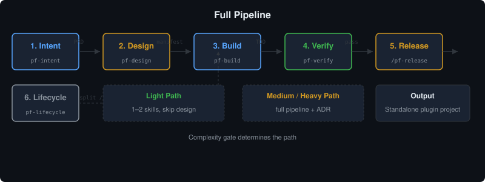

<p align="center">
  
</p>

**plugin-factory（插件工厂）** 是一个元插件：引导你的 AI 编程 Agent 仅凭你的**核心功能、目标、场景**，创建出**全新的、独立的 Agent 插件项目**。

你只需告诉 Agent"要做什么"，剩下的由它驱动：**意图访谈 → PRD → 设计 → TDD 构建（委托给 Anthropic 官方 skill-creator）→ 验证 → 发布 → 生命周期分析**。

> English version: [README.md](README.md)

---

## 工作流程

<p align="center">
  
</p>

| 阶段 | 技能 / 命令 | 产物 |
|------|-------------|------|
| **意图** | `pf-intent` | 一页式 PRD + 复杂度门禁（轻量→跳过设计，中/重型→全流程） |
| **设计** | `pf-design` | 构件清单 + 各平台 manifest 规格 + ADR（重型） |
| **构建** | `pf-build` | 独立插件项目；skill 走 skill-creator 的 TDD 循环（测试用例 → 实现 → 评测） |
| **验证** | `pf-verify` | 三层审计引擎（结构 → harness → 编排） |
| **发布** | `/pf-release` | SemVer 版本、CHANGELOG、双语 README、安装脚本 |
| **生命周期** | `pf-lifecycle` | 纯结构分析 → 推荐拆分 / 合并 / 重组 / 移植 / 退役 |

---

## 快速开始

**1. 安装**到你的 AI 编程 Agent：

| 平台 | 安装方式 |
|------|----------|
| Claude Code | `/plugin install plugin-factory@<marketplace>` 或本地插件 |
| pi | `pi install git:github.com/<you>/plugin-factory` |
| oh-my-pi (omp) | `omp plugin install git:github.com/<you>/plugin-factory` |
| opencode | 按 `.opencode/INSTALL.md` |

**2. 创建插件。** 运行 `/pf-new`（Claude Code）或告诉 Agent"我要做一个插件，它……"。

**3. 回答 8 个问题。** Agent 逐题采访：核心功能、目标、场景、触发条件、边界、平台、复杂度信号、语言偏好。

**4. 确认 PRD。** Agent 写一页 PRD，你确认。搞定——剩下的 Agent 自动推进。

**5. 拿到独立插件项目。** 新目录、双语 README、各平台 manifest、多 shell hooks、安装脚本、TDD 测试桩、生命周期探针。

---

## 支持的平台

四个平台均由自举冒烟测试（`npm run smoke`）验证。一个平台只有在 manifest、引导、技能发现路径与冒烟检查齐备时才被声明支持（T1 契约）。

| 平台 | 技能发现 | Hooks | 命令 |
|------|----------|-------|------|
| **Claude Code** | `skills/` | `.sh` + `.ps1` 配对，通过 `hooks.json` 绑定 | `commands/*.md` |
| **pi** | `package.json` → `pi.skills` | `.pi/extensions/<前缀>-bootstrap.ts` | `registerCommand` |
| **oh-my-pi (omp)** | `package.json` → `omp` / `pi` 字段 | `.pi/extensions/<前缀>-bootstrap.ts` | `registerCommand` |
| **opencode** | `.opencode/skills/`（scaffold 自动复制） | `.opencode/plugins/*.ts` | `.opencode/command/*.md` |

---

## 仓库结构

```
plugin-factory/
├── .claude-plugin/plugin.json    # Claude Code 插件清单
├── .pi/extensions/               # pi / oh-my-pi 引导扩展
├── .opencode/                    # opencode 配置 + INSTALL.md
├── skills/                       # pf-* 工作流子技能（规范位置）
├── commands/                     # /pf-* 斜杠命令
├── hooks/                        # 会话启动引导（多 shell）
├── references/                   # 设计文档（适配器、插件模型、生命周期矩阵）
├── scripts/                      # 脚手架/验证/生命周期/版本/发布（Node 核心 + shell 封装）
├── templates/                    # 共享 + 各平台模板
├── docs/                         # ADR、术语表、优化报告
└── tests/                        # 契约测试 + 冒烟测试（34 项通过）
```

---

## 设计原则

| 原则 | 说明 |
|------|------|
| **意图优先** | 无 PRD 不动工。签收的 PRD 是进入构建的唯一门票。 |
| **委托，不重写** | 技能创作委托给 Anthropic 的 **skill-creator**，plugin-factory 永不手写技能。 |
| **标准驱动渲染** | 技能按 Agent Skills 标准编写一次；各平台适配器只处理差异。 |
| **TDD 方法论** | 每个技能遵循 Red-Green-Refactor：先写测试用例 → 实现 → 验证。 |
| **CSO 描述** | 技能描述为纯触发条件（Condition-Situation-Outcome）："Use when…"，不含 workflow。 |
| **生命周期元数据** | 每个技能 frontmatter 含 `metadata.lifecycle`（状态 / 版本 / 创建时间 / 更新时间）。 |
| **质量自动化** | 每个声明的 platform、skill、command、hook、manifest 必须通过 `npm run verify`。 |
| **发布安全** | 准备与发布分离。发布门禁检查版本同步、证据、干净工作树——打标签和推送是用户的显式操作。 |

---

## 验证与质量

```bash
npm run validate        # 结构审计（Agent Skills 标准）
npm run validate:ps     # 同上，PowerShell 封装
npm test                # 完整测试套件（34 项，全部通过）
npm run lifecycle       # 生命周期探针审计
npm run release:check   # 发布门禁（版本同步、CHANGELOG、干净工作树）
```

---

## 许可证

[MIT](LICENSE)