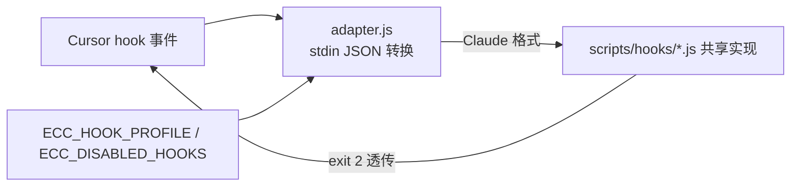

# ECC 设计思路分析 —— 以优化 plugin-factory 为视角

> 分析对象：affaan-m/ECC v2.1.0（本地仓库，HEAD `e4e41631`）· 分析日期 2026-08-01
> 分析口径沿用 repo-analyzer：标准 / 精简引入 / 聚焦优化。结论以本地源码为据。

---

## 1. 项目全景（精简）

ECC（"Everything Claude Code"的演进）自称 **"the agent harness operating system"**
（README 副标题）。v2.1.0 的规模：**67 agents、281 skills、94 个 legacy command
shims**，覆盖 10+ 个端目录（`.claude-plugin` / `.codex-plugin` / `.cursor` /
`.gemini` / `.hermes` / `.kimi` / `.kiro` / `.opencode` / `.agents` / `.codebuddy`），
3378 个跟踪文件。配 ecc.tools 官网、GitHub App、npm 包（`ecc-universal`、
`ecc-agentshield`）、**11+ 语言 README**、重度 CI/发布/供应链安全工程。

一句话定位：不是"方法论技能集"，而是**规模化多端的工程运营层**——用
harness-native 产物 + 选择性安装 + 文档化契约把 281 个技能卖给工程团队。

## 2. 设计哲学（与 superpowers 形成对照）

| 维度 | superpowers | ECC |
|------|-------------|-----|
| 内容策略 | **内容端无关**，写一次全端跑（工具映射逐端） | **harness-native**，逐端适配产物（技能按端分发，281 = 多端副本合计） |
| 适配机制 | 每端一个 bootstrap 注入器 | **hook 适配器**：Cursor 等端 → 转成 Claude 格式 → 复用共享 `scripts/hooks/*.js` |
| 规模策略 | 14 技能，靠写作纪律控膨胀 | 281 技能 + 67 agents，靠 **install profiles + 选择性安装 + agent-sort** 治理 |
| 契约 | 文档从设计出发 | **PLUGIN_SCHEMA_NOTES**：从真实安装失败反推未公开校验器约束 |
| 分发 | 市场/源码 | npm + GitHub App + marketplace + 官网多渠道，**官方渠道唯一** |

plugin-factory 选择了 superpowers 的"规范形式→逐端渲染"路线；ECC 的价值在于
展示**另一条路线的成本与治理手段**（技能副本膨胀 → 用分档/选择安装收敛）。

## 3. 核心模块深度分析

### M1 多端适配机制：hook 适配器 + profile 开关

`.cursor/hooks/adapter.js` 是核心模式：把 Cursor 的 stdin JSON **转换**成 Claude
Code hook 格式（`transformToClaude`：tool_input/tool_output/transcript_path 字段
映射），再 `execFileSync` 委托给共享的 `scripts/hooks/*.js`，阻塞退出码 2 透传。
配合 `hookEnabled()`：`ECC_HOOK_PROFILE`（minimal/standard/strict）+ 
`ECC_DISABLED_HOOKS`（逗号分隔列表）做**选择性启用**——hook 有档位、可关闭。

`.cursor/hooks.json` 展示 Cursor 的 hook schema 与 Claude 完全不同（`version: 1`、
`sessionStart`/`beforeShellExecution` 等事件名、`command: node ...`、无 matcher/type/
async）——印证我们 hooks-reference 里"每端机制不同、必须逐端固化"的判断。

### M2 规模治理：281 技能怎么不失控

- **选择性安装**：marketplace/install profiles 按档安装（`strict: false` 默认宽松）；
- **agent-sort**：专门技能把 ECC 技能集分成 DAILY vs LIBRARY 两档，按项目实际裁剪；
- **94 个 legacy shims**：老命令兼容层，避免破坏既有用户习惯；
- **agents 专业化**（`.kiro/agents/`）：code-reviewer、database-reviewer、
  django-reviewer、fsharp-reviewer…按语言/主题拆评审代理；
- **rules 矩阵**（`.cursor/rules/`）：`common-*` × golang/kotlin/php/python/swift/
  typescript 六语言 × coding-style/hooks/patterns/security/testing 五类——规则按
  (语言 × 维度) 生成式铺开。

### M3 契约工程：PLUGIN_SCHEMA_NOTES（对 plugin-factory 价值最高）

`.claude-plugin/PLUGIN_SCHEMA_NOTES.md`（231 行）记录了 **Claude 插件 manifest
校验器未公开但强制**的约束，全部来自真实安装失败：
- `version` **必填**（示例文档常省略，缺了 marketplace 安装/CLI 校验会挂）；
- `commands`/`skills`/`hooks` **必须是数组**，单条字符串会被拒
  （`agents: Invalid input` 这类模糊报错）；
- agent Markdown frontmatter 的 `tools` 用**标量**而非数组；
- 修改 plugin.json 前必须先读本文。

这正是我们 `plugins-reference` 里 ⚠️"完整 schema 待核实"的直接答案——ECC 已经把
实测约束文档化。

### M4 发布与运维工程

- **CI 复用**：`.github/workflows/` 有 reusable-test / reusable-validate /
  reusable-release 三件套 + release / release-announce / maintenance /
  monthly-metrics / supply-chain-watch / SLSA3 发布工作流；
- **版本同步**：plugin.json、marketplace.json（`plugins.0.version`）、package.json
  全部 2.1.0——与 superpowers 的 `.version-bump.json` 同一纪律；
- **npm 分发**：`ecc-universal` 发布 + **官方渠道唯一**警示（防仿冒/供应链攻击）；
- **11+ 语言 README**：社区运营模式（我们保持双语即可，不必学）。

## 4. 对 plugin-factory 的优化启发（核心章节）

| # | 可迁移决策 | ECC 做法 | plugin-factory 落地 | 优先级 |
|---|-----------|----------|---------------------|--------|
| ① | **hook 适配器 + profile 开关** | 端间 JSON 转换复用共享脚本；`ECC_HOOK_PROFILE` 分档 + 禁用列表 | hooks 渲染加"适配器层"（如 Cursor→Claude 转换）与 profile 分档；模板钩子带档位元数据 | 高 |
| ② | **契约文档化** | PLUGIN_SCHEMA_NOTES：从真实安装失败记录未公开校验器约束 | 直接吸收进 `references/plugins/claude-code.md`（version 必填、数组必须等），消掉 ⚠️ | 高 |
| ③ | **技能分档治理** | install profiles + agent-sort（DAILY/LIBRARY） | 生成插件时按复杂度给技能分档，防 281 式膨胀（回应 superpowers 报告的技能膨胀局限） | 中 |
| ④ | **选择性安装** | marketplace `strict` + 档位 | 生成插件 manifest 带安装档位（minimal/standard/strict） | 中 |
| ⑤ | **共享 hook 脚本** | 各端 adapter 委托同一 `scripts/hooks/*.js` | 我们的"多 shell 渲染"升级为"共享实现 + 端适配器"，减少三端三份实现 | 中 |
| ⑥ | **版本同步纪律** | 三 manifest 同版本 + CHANGELOG | 印证 pf-release 全 manifest 同步；建议吸收 superpowers 的 bump-version 脚本实现 | 已规划 |
| ⑦ | **发布安全** | 官方渠道唯一警示、SLSA3、supply-chain-watch | 生成插件的 README 加"官方渠道唯一"警示段 | 低 |
| ⑧ | 不学 | 11+ 语言 README、94 shims、67 agents | 双语保持；shims/agents 按需生成 | — |

**建议落地顺序**：①②（直接吸收，高收益）→ ③④⑤（生成器增强）→ ⑥⑦。

## 5. 评价与启发

**优点**：契约工程（PLUGIN_SCHEMA_NOTES 从失败中学习并文档化）是全场最佳实践；
hook 适配器 + profile 的分层让"一套实现多端复用 + 用户可裁剪"；规模治理
（分档/选择安装/sort）诚实面对技能膨胀；发布工程（CI 复用 + SLSA3 + 官方渠道）
接近企业级。

**局限**：281 技能 = 逐端副本叠加，维护与一致性成本高（superpowers 用"内容端无关"
从根上避免）；67 agents 的门槛对个人用户过重；多语言 README 是运营负担而非技术
价值。

**对 plugin-factory 的最终启发**：ECC 与 superpowers 是两条路线的两极——**内容
端无关（写一次渲染全端）vs harness-native（逐端原生副本）**。我们已选前者（正确，
成本低）；从 ECC 学的是它的**机制补丁**：hook 适配器与 profile、契约文档化、
技能分档治理、发布安全——这些不改变我们的架构，而是填上 superpowers 路线缺失的
"规模化运维"能力。
