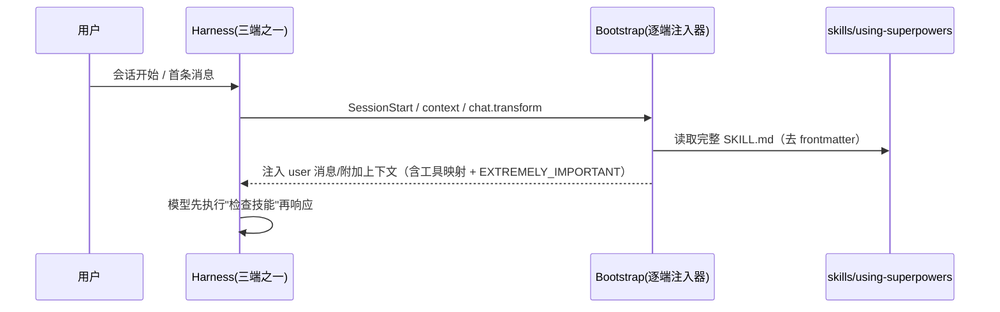
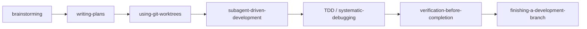

# superpowers 设计思路分析 —— 以优化 plugin-factory 为视角

> 分析对象：obra/superpowers v6.2.0（本地仓库，HEAD `44c9b2d`）· 分析日期 2026-08-01
> 工具：repo-analyzer（标准分析 / 精简引入 / 聚焦优化）。所有结论以源码为据。
> 原始工作区：`~/repo-analyses/superpowers-20260801/`（含 drafts/）。

---

## 1. 项目全景（精简）

superpowers 是一套把**软件开发方法论**打包成 agent 技能的插件：14 个技能、
覆盖 6+ 个端（Claude Code / Codex / Cursor / Gemini CLI / Kimi / opencode / pi /
Copilot CLI）、v6.2.0、180 个跟踪文件、约 3.95 万行（含测试与文档）。

核心命题：编码 agent 开箱只有"能力"、没有"纪律"。superpowers 用**引导注入 +
技能链**让任何模型获得一致的工程过程——头脑风暴 → 计划 → worktree → 子代理执行 →
TDD → 评审 → 收尾。它不教 agent"干什么"，而是强制 agent"**开始任何事之前先检查
该用什么技能**"。

## 2. 设计哲学（贯穿主线）

1. **引导先行（bootstrap 是全部集成）**：`docs/porting-to-a-new-harness.md` 原话
   ——"The bootstrap is the entire integration. Without it, the skill files are
   inert"。技能文件躺在磁盘上若不注入，等于不存在。
2. **动作不点名工具**：`skills/` 写动作词汇（"invoke a skill"、"dispatch a
   subagent"），绝不写具体工具名；工具映射逐端翻译。一个技能体在所有端原样运行。
3. **只走安装机制**：bootstrap/技能/映射全部随 harness 的安装物交付，**绝不改用户
   的全局或个人配置**；"Opt-in isn't a port"——需要用户每会话手动操作的移植就是失败。
4. **技能 = 塑造行为的代码，不是散文**：技能正文是经过精心调校的"行为塑形代码"，
   改写即被拒绝（CLAUDE.md：贡献者对"合规式"技能改写一律关闭 PR）。
5. **用测试与评测管质量**：`tests/`（非 LLM 代码）+ `evals/`（真实 LLM 会话行为）。

## 3. 核心模块深度分析

### M1 统一入口与引导注入

`skills/using-superpowers/SKILL.md` 只有几十行，却是全项目的心脏：极简 CSO 描述 +
`<EXTREMELY-IMPORTANT>` 强约束块 + 12 行 Red Flags 表（自我合理化拆穿：
"Let me explore the codebase first"→"Skills tell you HOW to explore. Check first."）+
`<SUBAGENT-STOP>` 守卫（子代理不执行入口）+ Skill Priority（process skills 优先）。

三端注入机制对比（同目标、三种事件模型）：

| 端 | 机制 | 注入时机 | 幂等策略 |
|----|------|----------|----------|
| Claude/Cursor/Copilot | `hooks/session-start` bash → stdout JSON `additionalContext` | SessionStart | 按 `CLAUDE_PLUGIN_ROOT`/`CURSOR_PLUGIN_ROOT`/`COPILOT_CLI` 环境变量分支出不同 JSON 字段 |
| pi | `.pi/extensions/superpowers.ts`：`resources_discover` 注册技能目录 + `context` 事件注入 user 消息 | session_start / session_compact 后（lifecycle flag），`agent_end` 关闭 | `messageContainsBootstrap` 标记去重；compaction 后重注入 |
| opencode | `.opencode/plugins/superpowers.js`：`config` 钩子注册技能路径 + `experimental.chat.messages.transform` | 每个 agent step | 模块级缓存 + 首条消息含 `EXTREMELY_IMPORTANT` 检查 |

洞察：注入内容 = **完整 SKILL.md**（不是提示词），强约束标记保证不可忽略；
幂等守卫必须逐端定制（opencode 每 step、pi 每 turn 触发，去重策略不能互相抄）。

### M2 多端适配的不变量

三组件模型：**技能（端无关）+ 工具映射（逐端）+ bootstrap（逐端）**。
工具映射在 `skills/using-superpowers/references/<harness>-tools.md` 和/或 bootstrap
内联（pi 双份，改一处会漏）。

两条铁律：① 技能命名动作、不点名工具——移植只加映射和注入器，**永不改技能体**
（contributor rules 把改写视为"破坏行为塑形代码"）；② 一切随安装机制交付——每端
一个 manifest（`.claude-plugin/`、`.codex-plugin/`、`.pi/extensions/`、
`.opencode/plugins/`、`gemini-extension.json`、`.kimi-plugin/`）。

验收标准：干净会话下"Let's make a react todo list"**必须自动触发 brainstorming**
（tests 里的验收测试）；伪集成（手抄文件、npx shim、每会话 opt-in）被明令禁止。

### M3 技能创作方法论

`writing-skills` 把 TDD 套到文档上：铁律 **NO SKILL WITHOUT A FAILING TEST FIRST**、
SDO（description 只写 when 不写 what、关键词覆盖、动词式命名）、
"Match the Form to the Failure"（规则违反→禁令表；输出形状错→配方/契约）。

技能共性骨架：**铁律 + 合理化借口表 + 红旗清单 + 流程图 + 强制清单**——
`test-driven-development`（NO PRODUCTION CODE WITHOUT A FAILING TEST FIRST）、
`systematic-debugging`（NO FIXES WITHOUT ROOT CAUSE INVESTIGATION FIRST，≥3 次修复
失败即 STOP 质疑架构）、`brainstorming`（HARD-GATE：未经设计批准禁止实现）、
`subagent-driven-development`（ledger 抗压缩、评审双判定、修复上限 5 轮、断路器）。

技能链（与 plugin-factory orchestration-patterns 链式模式对应）：

测试分层：`tests/`（bash+node 集成）vs `evals/`（drill harness 驱动真实 tmux
会话，单场景 3–30+ 分钟，**目前不在 CI**；作者自认下一步是"PR 快速子集 +
夜间全量"分层）。

### M4 版本与发布工程

`.version-bump.json` 声明 **8 处**版本文件（package.json、各端 plugin.json、
marketplace.json 的 `plugins.0.version`、gemini-extension.json），
`scripts/bump-version.sh` 提供：
- `<ver>`：统一改声明文件；
- `--check`：**漂移检测**（所有声明文件版本必须一致）；
- `--audit`：全仓 grep 旧版本串，找出**未声明**的版本引用文件。

打包门禁：`package-codex-plugin.sh` **dirty worktree 拒绝打包**、校验每个技能含
OpenAI 元数据；`sync-to-codex-plugin.sh` 同步 fork 并保证确定性。
发布：无固定日期节奏、SemVer、`RELEASE-NOTES.md` 按版本倒序，每条目
"加粗结论 + 问题→根因→方案→eval 证据（含 baseline/treatment 数据与 issue 号）"。

## 4. 对 plugin-factory 的优化启发（核心章节）

| # | 可迁移决策 | superpowers 做法 | plugin-factory 落地 | 优先级 |
|---|-----------|------------------|---------------------|--------|
| ① | **引导要"强制"而非"提示"** | `<EXTREMELY-IMPORTANT>` + Red Flags 自我合理化拆穿表 | 强化 `using-pf/SKILL.md`：加强约束块 + 路由理由表（"先检查再响应"） | 高 |
| ② | **注入内容=完整引导技能 + 逐端幂等** | 三端 bootstrap 注入完整 SKILL.md，幂等守卫逐端定制 | 更新 templates/hooks 生成规则：注入完整 `using-<plugin>`，去重按端实现 | 中 |
| ③ | **每端验收场景** | 干净会话"make a react todo list"→ 自动触发 | 加入 pf-verify 的 M4 标准：生成插件后跑干净会话验证自动触发 | 中 |
| ④ | **动作词汇 + 逐端工具映射层** | `references/<harness>-tools.md` + 内联映射 | pf-build 生成规则：技能写动作、生成 `<plugin>/references/<harness>-tools.md` | 高 |
| ⑤ | **行为评测分层** | tests（结构/代码）+ evals（真实会话） | tests 已有 validate 脚本；evals 借 skill-creator A/B 评测（M4 dogfood 启用） | 中 |
| ⑥ | **版本工程机械化** | `.version-bump.json` 声明清单 + --check/--audit | 实现 `scripts/bump-version.sh`（漂移检测 + 审计），pf-release 调用 | 高 |
| ⑦ | **发布叙事** | RELEASE-NOTES 条目 = 结论+问题→根因→方案→证据 | 吸收进 pf-release CHANGELOG 规则（生命周期动因 + eval 证据） | 高 |
| ⑧ | **打包门禁** | dirty worktree 拒绝打包、元数据校验 | pf-release 规则补充"工作区干净才可发布" | 中 |
| ⑨ | 已覆盖（无需学） | 单一入口 using-*、多端 manifest、编排链、语言分层、生命周期循环 | 已实现，见 references/ | — |

**建议落地顺序**：①④⑥⑦（高收益低投入）→ ②⑧（中）→ ③⑤（依赖 dogfood 与
skill-creator，M4）。

## 5. 评价与启发

**优点**：引导机制的彻底性（bootstrap=全部集成，接受度测试拒绝 opt-in）；
内容端无关的写作纪律（动作词汇 + 逐端映射，内容与机制解耦）；测试分层的前瞻
（tests vs evals 分开）；治理的严格（CLAUDE.md 自称 94% PR 被拒率，技能改动必须
附 eval 证据）。

**局限**：14 个技能已开始膨胀——v6.2.0 release notes 自己做 "skills compression
sweep"；evals 不在 CI（慢）；方法论对小型用户过重（每个会话强制技能检查的成本）。

**对 plugin-factory 的最终启发**：**复制机制，不复制内容**。superpowers 值得学的
是它那套机制——引导强制、工具映射、每端验收、版本漂移检测、评测分层；技能内容
本身应由 skill-creator 按需创作（这正是 plugin-factory 铁律 #2 的定位）。我们的
"单一入口 + 场景化生命周期 + 语言分层 + 多端固化"骨架与它的设计同构，差距在
① 引导的强制力 ② 版本/发布工程的机械化 ③ 每端验收场景 ④ 工具映射层——
即上表 ①②③④⑥⑦。
