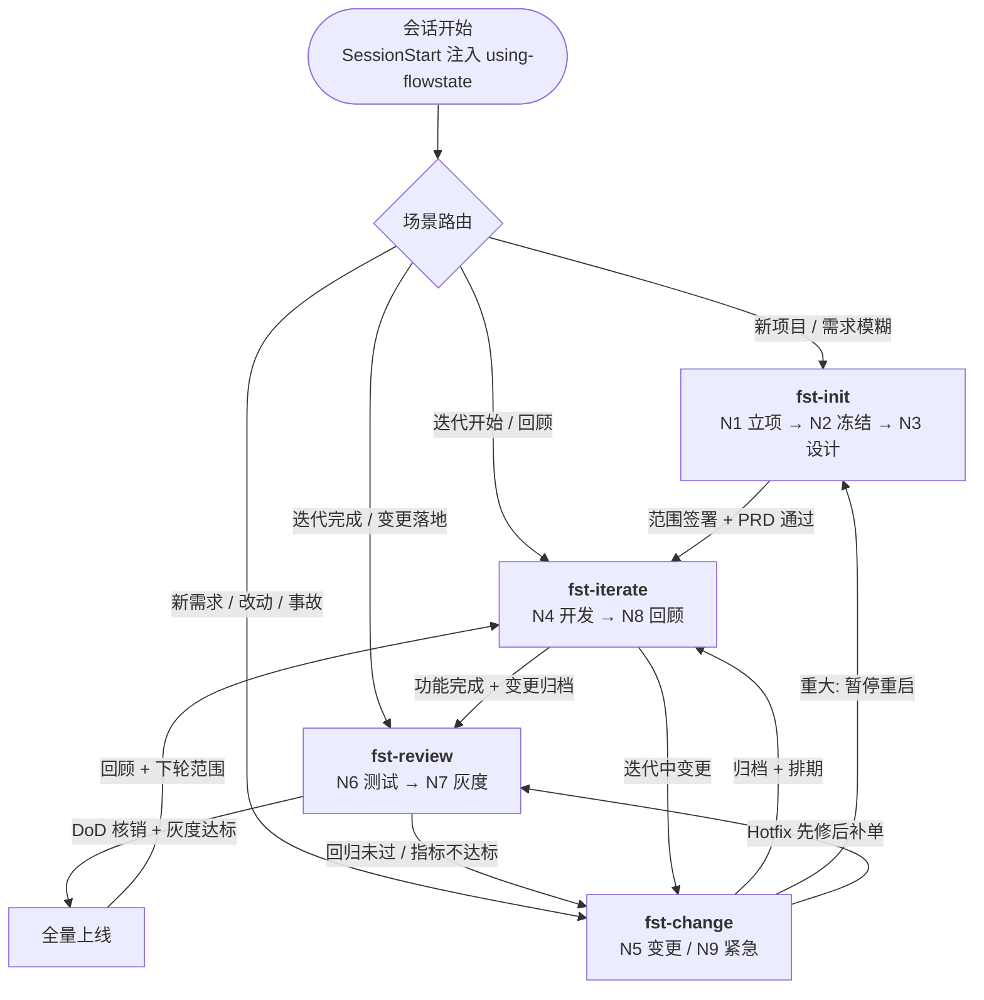

# flowstate

**项目开发全流程规范插件** — 引导 AI 编程助手在**需求不全、中途变更、持续迭代**的真实项目中，按"先锁核心底线、边做边补、可控变更、持续校准"流程工作。

> 中文介绍 · English overview 见 `docs/README.md`（文档地图）与 `docs/PRD.md`（完整需求）。

## 这是什么

flowstate 把整个开发过程建模为一张**可执行的状态图（Agent Graph）**——节点是流程环节（N1~N9），边是 DoD 流转判据，人工闸门（HITL）强制等人确认。**图为逻辑蓝图，采用动态软编排**：由 Claude Code / Codex 等 Agent 框架按 skills/commands 原生驱动执行，不做代码级硬编排。

## 功能总览

flowstate 由 5 类交付物组成，覆盖「引导 → 产出 → 校验 → 落地」全链路：

| 交付物 | 数量 | 作用 |
|--------|------|------|
| 技能 `skills/` | 6 | 分场景引导（入口路由 + 5 个流程技能） |
| 命令 `commands/` | 4 | 斜杠命令快捷入口（`/fst-*`，加载对应技能） |
| 产出模板 `schemas/` | 9 | 产出物 JSON 契约（需求分层 / 范围 / 变更单 / DoD / …） |
| 生命周期钩子 `hooks/` | 2 | SessionStart 自动注入入口技能（bash + PowerShell） |
| 工作区模板 `templates/` | 1 | `.agent-workplace` 私有工作区骨架 |

### 技能与命令（引导层）

| 技能 | 命令 | 管哪些节点 | 功能 | 最佳实践 |
|------|------|-----------|------|---------|
| `using-flowstate` | — | 入口路由 | 按场景路由到 fst-* | — |
| `fst-init` | `/fst-init` | N1 立项、N2 冻结、N3 设计 | F1~F3 | Spec 模式 |
| `fst-change` | `/fst-change` | N5 变更、N9 紧急 | F5/F9 | Plan 模式 |
| `fst-review` | `/fst-review` | N6 测试、N7 灰度 | F6/F7 | DoD 核销清单 |
| `fst-iterate` | `/fst-iterate` | N4 迭代、N8 闭环 | F4/F8 | Spec / Loop / Graph 方略 |
| `fst-workplace` | — | 横切 N1~N9 | 工作区初始化 / 落点判断 / 过程态管理 | — |

命令是技能的快捷入口：加载并遵循对应 `SKILL.md`。工作区规则只在 `fst-workplace` 单点维护，其他技能只引用不重复。

**fst-iterate 的三种方略（需求驱动选择）**：先盘点本轮需求（范围说明书 REQ + 变更单 CR + 需求池条目）→ 按需求特征选方略 → 设计 → 执行。每 phase 在 `docs/plan` 声明 `strategy`：

| 需求特征 | 方略 | 链条 | 可验证 |
|------|------|------|--------|
| 常规开发、验收点清晰 | **spec**（默认） | `phase→task→spec` | ✅ 任务完成 = 验收核销 |
| 目标明确但边界模糊、需反复逼近 | **loop** | `phase→loop` / `phase→task→loop` | ✅ 每轮有验证信号 |
| 依赖复杂、跨模块、可并行 | **graph** | `phase→graph` / `phase→task→graph` | ✅ 每节点 DoD 守卫 |
| 一句话能说清 diff 的简单任务 | 不进方略，直接做 | todo 轻量清单 | — |

### 产出模板（校验层）

9 个 JSON Schema 对应 PRD §5.1~5.9 产出物，供脚本校验（`npm test`，参照 plugin-factory `schemas/` 模式）：

| Schema | 产出物 | 对应功能 |
|--------|--------|---------|
| `requirements-layer` | 需求分层清单 | F1/F2 |
| `scope` | 迭代范围说明书 | F2 |
| `change-request` | 变更申请单 | F5/F9 |
| `dod-checklist` | 迭代验收 Checklist（DoD） | F4/F6 |
| `risk-list` | 风险清单 | F1/F8 |
| `tech-debt` | 技术债清单 | F4/F8 |
| `retrospective` | 迭代回顾报告 | F8 |
| `plan` | 开发计划 `docs/plan` | F4.1 |
| `task` | 任务清单 `docs/task` | F4.1 |

### 工作区与钩子（基础设施层）

- **`.agent-workplace/`** — Agent 私有工作区：过程态草稿/脚本/state **全部不提交 git**，定稿才写正式 `docs/`；规范见 `docs/agent-workplace.md`，初始化与落点见 `fst-workplace`
- **SessionStart 钩子** — 会话开始自动注入 `using-flowstate` 入口技能（marker `FLOWSTATE_BOOTSTRAP:flowstate`），不依赖 node 运行时；bash + PowerShell 双变体

## 工作流程（功能如何串成一条线）

flowstate 的核心不是单个技能，而是一条**由技能/命令驱动、按状态图流转的链路**：

### 流转判据（边上的 DoD 守卫）

未核销不得沿边前进，全部节点必须人工/DoD 确认：

| 从 | 到 | 流转条件 |
|----|----|---------|
| N1 立项 | N2 冻结 | 3 条底线书面确认 |
| N2 冻结 | N3 设计 | 范围说明书签署 |
| N3 设计 | N4 开发 | 柔性 PRD 评审通过 |
| N4 开发 | N6 测试 | 功能完成 + 变更归档 |
| N6 测试 | N7 灰度 | 核心回归通过 + 变更点测试通过 |
| N7 灰度 | 全量 | 灰度指标达标 |
| 全量 / 迭代末 | N8 回顾 | 回顾完成 + 下轮范围确定 |
| N8 回顾 | N4 开发 | 下轮迭代开始（闭环） |

### 三条回环

| 回环 | 路径 | 作用 |
|------|------|------|
| **变更回环** | N4 → N5 → N4（轻微/中度）或 → N3（重大，暂停重启） | 迭代内需求变更反复评估直到收敛 |
| **迭代闭环** | N8 → N4 | 持续迭代外层大循环，回顾后进入下轮 |
| **Hotfix 短路** | 任意节点 → N9 → N6 | 线上事故先修后补单（24h 内补录变更单） |

### 强制闸门（HITL）与断点（Checkpoint）

- **HITL**：底线确认（N1 出口）、范围签署（N2 出口）、PRD 评审（N3）、变更分级/重大审批（N5）、DoD 核销（N6）、放量/全量决策（N7）——图执行到这些点**强制暂停等人**
- **Checkpoint**：每个节点完成即保存状态（产出物 + 流转记录，落 `.agent-workplace/state/checkpoint.json`），中断可断点续跑

### 完整示例

「工单管理系统」端到端走完全流程的示例见 `docs/PRD.md` §九。

## 多端支持（harnesses）

flowstate 是跨端插件：技能按 Agent Skills 标准写一次，各端原生加载。

| 端 | manifest | 技能发现 | 入口引导 |
|----|----------|---------|---------|
| Claude Code | `.claude-plugin/plugin.json` | `skills/` | `using-flowstate` + **SessionStart hook** 自动注入 |
| pi | `package.json` → `pi.skills` | `skills/` | `.pi/extensions/fst-bootstrap.ts` 注入 |
| oh-my-pi (omp) | `package.json` → `omp.skills` | `skills/` | 复用 pi bootstrap（见 `OMP-NOTES.md`） |
| opencode | `.opencode/opencode.json` | `.opencode/skills/`（预复制） | `.opencode/plugins/fst-bootstrap.ts` 注入（见 `.opencode/INSTALL.md`） |

各端安装方式见对应端说明：`OMP-NOTES.md`（omp）、`.opencode/INSTALL.md`（opencode）。

> **双 manifest 设计**：根 `plugin.json` 是 pi/omp 的最小 manifest（name/version/description）；`.claude-plugin/plugin.json` 是 Claude Code manifest（含 tags、keywords、skills、commands）。两者的 name/version/description 保持同步。

## Hooks（质量门禁 / 会话引导）

`hooks/` 提供 Claude Code 生命周期 hooks（bash + PowerShell 双变体）：

| Hook | 事件 | 作用 |
|------|------|------|
| `session-start.sh` / `.ps1` | SessionStart | 注入 `using-flowstate` 入口技能（marker `FLOWSTATE_BOOTSTRAP:flowstate`），会话开始即建立流程框架引导 |

> 轻量自包含：直接读 SKILL.md 输出，不依赖 node 运行时；多 shell 对齐 plugin-factory 约定。

## 文档

见 `docs/README.md`（文档地图）：PRD、ADR-0001（命名）、ADR-0002（图编排）、glossary、skill-split（技能拆分）。
