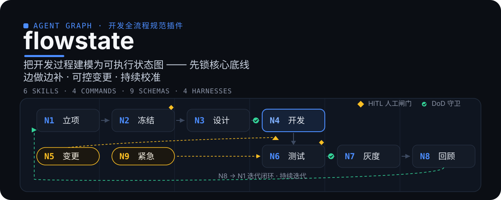
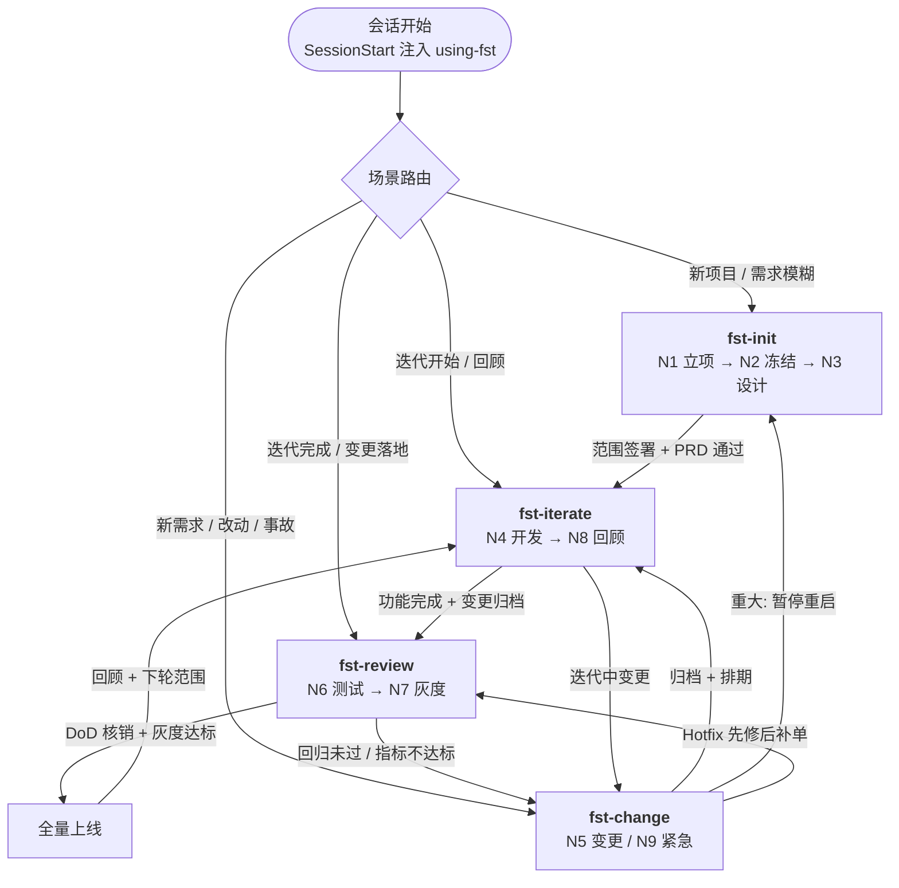

# flowstate

<p align="center">
  
</p>

> **文档地图**：中文介绍见本文件；完整需求见 [`docs/PRD.md`](docs/PRD.md)；文档导航见 [`docs/README.md`](docs/README.md)。

## 这是什么

flowstate 是一个**项目开发全流程规范插件**：引导 AI 编程助手在**需求不全、中途变更、持续迭代**的真实项目中，按「先锁核心底线、边做边补、可控变更、持续校准」流程工作——而不是拿到一句话需求就直接开写。

它不是代码框架，而是一套**流程契约**：告诉 Agent 每个阶段该做什么、产出什么、哪些必须等人确认、什么情况下必须停下。

## 为什么不一样

| 机制 | 说明 |
|------|------|
| **可执行状态图** | 把整个开发过程建模为 N1~N9 状态图，DoD 判据控制沿边流转，**图为逻辑蓝图、动态软编排**——由各端 Agent 框架原生驱动，不做代码级硬编排 |
| **规划与执行分离** | `fst-change` 只做规划与约束（记录原文 → 分级 → 影响评估 → 审批排期 → 归档），**不写代码**；所有实现统一由 `fst-iterate` 作为唯一执行入口按方略驱动。唯一例外是线上事故 Hotfix（N9）——先修后补单，24h 内补录变更单 |
| **需求驱动方略** | 方略不是拍脑袋选的，由**本轮迭代的需求**决定（lightweight todo / spec / loop / graph），不同 phase 可按各自需求特征选不同方略 |
| **DoD 守卫 + HITL 闸门** | 未核销不得沿边前进；底线确认、范围签署、PRD 评审、变更分级、DoD 核销、放量决策**强制暂停等人** |
| **Checkpoint 断点续跑** | 每个节点完成即保存状态，中断可续跑 |
| **私有工作区 + 提交门禁** | `.agent-workplace/` 过程态永不提交 git，PreCommit 钩子硬性拦截 |

<p align="center">
  
</p>

## 功能总览

flowstate 由 6 类交付物组成，覆盖「引导 → 产出 → 校验 → 落地」全链路：

| 交付物 | 数量 | 作用 |
|--------|------|------|
| 技能 `skills/` | 8 | 分场景引导（入口路由 + 6 个流程技能 + 2 个横切能力；方略选择内联于 fst-iterate） |
| 命令 `commands/` | 5 | 斜杠命令快捷入口（`/fst-*`，加载对应技能） |
| 产出模板 `schemas/` | 12 | 产出物 JSON 契约（需求分层 / 范围 / 变更单 / DoD / 文档状态 / 事实核查 / 提升请求） |
| 生命周期钩子 `hooks/` | 4 类 | SessionStart + PreCommit + PostCompact + DocumentStatusCheck |
| 初始化脚本 `scripts/` | 2 | `fst-workplace-init`（bash + PowerShell）：幂等创建/修复 `.agent-workplace` |
| 工作区模板 `templates/` | 2 | 迭代模板 + 工作区模板 |

### 技能族

<p align="center">
  
  
  
</p>
<p align="center">
  
  
</p>

| 技能 | 命令 | 管哪些节点 | 功能 | 最佳实践 |
|------|------|-----------|------|---------|
| `using-fst` | — | 入口路由 | 按场景路由到 fst-* | — |
| `fst-init` | `/fst-init` | N1 立项、N2 冻结、N3 设计 | F1~F3 | 访谈澄清 + 需求分层 |
| `fst-change` | `/fst-change` | N5 变更、N9 紧急 | F5/F9（**只规划约束**） | 先探索后计划 |
| `fst-review` | `/fst-review` | N6 测试、N7 灰度 | F6/F7 | DoD 核销清单 |
| `fst-iterate` | `/fst-iterate` | N4 迭代、N8 闭环 | F4/F8（**唯一执行入口**） | Spec / Loop / Graph 方略 |
| `fst-promote` | `/fst-promote` | 横切 N1~N9 | **定稿闸门**（过程文档 → 定稿文档） | HITL 确认 + 溯源注入 |
| `fst-workplace` | — | 横切 N1~N9 | 工作区初始化 / 落点判断 / 过程态管理 | 双文档系统支持 |

命令是技能的快捷入口：加载并遵循对应 `SKILL.md`。工作区规则只在 `fst-workplace` 单点维护，其他技能只引用不重复。

### fst-iterate 的执行路径（需求驱动的方略 + lightweight todo）

先盘点本轮需求（范围说明书 REQ + 变更单 CR + 需求池条目）→ 按需求特征选方略 → 设计 → 执行。每 phase 在 `docs/plan` 声明 `strategy`：

| 需求特征 | 方略 | 链条 | 可验证 |
|------|------|------|--------|
| 常规开发、验收点清晰 | **spec**（默认） | `phase→task→spec` | ✅ 任务完成 = 验收核销 |
| 目标明确但边界模糊、需反复逼近 | **loop** | `phase→loop` / `phase→task→loop` | ✅ 每轮有验证信号 |
| 依赖复杂、跨模块、可并行 | **graph** | `phase→graph` / `phase→task→graph` | ✅ 每节点 DoD 守卫 |
| 已批准范围内的一句话 diff | lightweight todo | `fst-iterate` 内最小执行路径 | 最小验证 |

### 产出模板（校验层）

9 个 JSON Schema 对应 PRD §5.1~5.9 产出物，供脚本校验（`npm test`，参照 plugin-factory `schemas/` 模式）：

| Schema | 产出物 | 对应功能 |
|--------|--------|---------|
| `requirements-layer` | 需求分层清单 | F1/F2 |
| `scope` | 迭代范围说明书 | F2 |
| `change-request` | 变更申请单 | F5/F9 |
| `dod-checklist` | 迭代验收 Checklist（DoD） | F4/F6 |
| `risk-list` | 风险清单 | F1/F8 |
| `tech-debt` | 技术债清单 | F4/F8 |
| `retrospective` | 迭代回顾报告 | F8 |
| `plan` | 开发计划 `docs/plan` | F4.1 |
| `task` | 任务清单 `docs/task` | F4.1 |

### 工作区与钩子（基础设施层）

- **`.agent-workplace/`** — Agent 私有工作区：过程态草稿/脚本/state **全部不提交 git**，定稿才写正式 `docs/`；规范见 `docs/agent-workplace.md`，初始化与落点见 `fst-workplace`
- **SessionStart 钩子** — 会话开始自动注入 `using-fst` 入口技能（marker `FLOWSTATE_BOOTSTRAP:flowstate`），不依赖 node 运行时；bash + PowerShell 双变体
- **PreCommit 门禁** — 提交前拦截 `.agent-workplace/` 入提交与疑似密钥泄漏，守护「私有区永不提交」铁律；bash + PowerShell 双变体

<p align="center">
  
</p>

## 工作流程（功能如何串成一条线）

flowstate 的核心不是单个技能，而是一条**由技能/命令驱动、按状态图流转的链路**：



### 流转判据（边上的 DoD 守卫）

未核销不得沿边前进，全部节点必须人工/DoD 确认：

| 从 | 到 | 流转条件 |
|----|----|---------|
| N1 立项 | N2 冻结 | 3 条底线书面确认 |
| N2 冻结 | N3 设计 | 范围说明书签署 |
| N3 设计 | N4 开发 | 柔性 PRD 评审通过 |
| N4 开发 | N6 测试 | 功能完成 + 变更归档 |
| N6 测试 | N7 灰度 | 核心回归通过 + 变更点测试通过 |
| N7 灰度 | 全量 | 灰度指标达标 |
| 全量 / 迭代末 | N8 回顾 | 回顾完成 + 下轮范围确定 |
| N8 回顾 | N4 开发 | 下轮迭代开始（闭环） |

### 三条回环

| 回环 | 路径 | 作用 |
|------|------|------|
| **变更回环** | N4 → N5 → N4（轻微/中度）或 → N3（重大，暂停重启） | 迭代内需求变更反复评估直到收敛 |
| **迭代闭环** | N8 → N4 | 持续迭代外层大循环，回顾后进入下轮 |
| **Hotfix 短路** | 任意节点 → N9 → N6 | 线上事故先修后补单（24h 内补录变更单） |

### 强制闸门（HITL）与断点（Checkpoint）

- **HITL**：底线确认（N1 出口）、范围签署（N2 出口）、PRD 评审（N3）、变更分级/重大审批（N5）、DoD 核销（N6）、放量/全量决策（N7）——图执行到这些点**强制暂停等人**
- **Checkpoint**：每个节点完成即保存状态（产出物 + 流转记录，落 `.agent-workplace/state/checkpoint.json`），中断可断点续跑

### 完整示例

「工单管理系统」端到端走完全流程的示例见 `docs/PRD.md` §九。

<p align="center">
  
</p>

## 快速开始

1. **安装插件** — 用你的端加载本仓库（marketplace 注册于仓库根 `.claude-plugin/marketplace.json`，一个仓库 = 一个市场）：

   ```bash
   # pi / oh-my-pi
   /plugin marketplace add morning-start/agent-plugins
   /plugin install flowstate@agent-plugins
   ```

   Claude Code 直接以本地插件加载 `flowstate/`（或复制到项目的 `.claude-plugin/`）；opencode 见 `.opencode/INSTALL.md`。

2. **开始会话** — SessionStart 钩子自动注入 `using-fst` 入口技能（Claude Code 免手动；pi/omp/opencode 由各自 bootstrap 注入）
3. **按场景路由** — 说「新项目 / 要改需求 / 迭代开始了 / 准备验收」，入口技能会引导你到对应 `fst-*` 技能

| 端 | manifest | 技能发现 | 入口引导 |
|----|----------|---------|---------|
| Claude Code | `.claude-plugin/plugin.json` | `skills/` | `using-fst` + **SessionStart hook** 自动注入 |
| pi | `package.json` → `pi.skills` | `skills/` | `.pi/extensions/fst-bootstrap.ts` 注入 |
| oh-my-pi (omp) | `package.json` → `omp.skills` | `skills/` | 复用 pi bootstrap（见 `OMP-NOTES.md`） |
| opencode | `.opencode/plugins/fst-bootstrap.ts`（`config` 钩子运行时注册 `skills/`） | `skills/`（单一源） | 同左，bootstrap 注入（见 `.opencode/INSTALL.md`） |

各端安装方式见对应端说明：`OMP-NOTES.md`（omp）、`.opencode/INSTALL.md`（opencode）。

> **单 manifest 设计**：技能唯一源 `skills/` 服务所有端——Claude Code 用 `.claude-plugin/plugin.json`（含 tags、keywords、skills、commands）；pi/omp 由 `package.json` 的 `pi.skills`/`omp.skills` 承载；opencode 由 `.opencode/plugins/fst-bootstrap.ts` 运行时注册。无重复 manifest、无需跨文件同步。

<p align="center">
  
</p>

## 多端支持（harnesses）

flowstate 是跨端插件：技能按 Agent Skills 标准写一次，各端原生加载。技能清单与安装方式见上表；`docs/PRD.md` §附录含与原流程文档的差异说明。

## Hooks（质量门禁 / 会话引导）

`hooks/` 提供 Claude Code 生命周期 hooks（bash + PowerShell 双变体）：

| Hook | 事件 | 作用 |
|------|------|------|
| `session-start.sh` / `.ps1` | SessionStart | 注入 `using-fst` 入口技能（marker `FLOWSTATE_BOOTSTRAP:flowstate`）＋ **自动初始化 `.agent-workplace/`**，会话开始即具备流程框架与落点 |
| `pre-commit.sh` / `.ps1` | PreCommit（git 门禁） | 拦截 `.agent-workplace/` 入提交 + 疑似密钥扫描，守护「私有区永不提交」铁律 |

> 轻量自包含：直接读 SKILL.md 输出 / git diff，不依赖 node 运行时；多 shell 对齐 plugin-factory 约定。

### 自动工作区初始化

`.agent-workplace/` 是全部 fst-* 技能的落点，缺了它任何过程态产物都无处可写。
SessionStart 会自动跑 `scripts/fst-workplace-init.*`（幂等，重复运行无副作用）：

```bash
# 手工执行（通常不需要，仅用于被跳过的目录或切换迭代）
bash <plugin-root>/scripts/fst-workplace-init.sh --root <项目根>
& <plugin-root>\scripts\fst-workplace-init.ps1 -Root <项目根>
```

- 项目根需有项目标记（`.git` / `package.json` / `Cargo.toml` / …）才会自动初始化，
  否则只提示不建目录；强制初始化加 `--force` / `-Force`
- 关闭自动初始化：`FLOWSTATE_AUTO_WORKPLACE=0`
- `iterations/current` 指针按 symlink → NTFS junction → 显式路径降级
  （Windows 无提权时 `ln -s` 会退化成目录复制，junction 无需管理员），
  实际模式记录在 `.agent-workplace/state/workspace.json`

## 文档

- [`docs/README.md`](docs/README.md) — 文档地图（四象限导航）
- [`docs/PRD.md`](docs/PRD.md) — 完整需求（功能 F1~F9、产出物模板、执行图、端到端示例）
- [`docs/ADR-0001-naming.md`](docs/ADR-0001-naming.md) — 命名决策（为什么叫 flowstate / 前缀 fst-）
- [`docs/ADR-0002-agent-graph.md`](docs/ADR-0002-agent-graph.md) — Agent 图编排决策
- [`docs/glossary.md`](docs/glossary.md) — 术语表（DoD / 骨架开发 / 需求池）
- [`docs/skill-split.md`](docs/skill-split.md) — 技能拆分方案
 - [`references/skill-graph.md`](references/skill-graph.md) — 技能关系、交接边契约与越权边界
- [`references/agent-modes/README.md`](references/agent-modes/README.md) — 操作模式注册、选择协议与统一契约
- [`docs/agent-workplace.md`](docs/agent-workplace.md) — Agent 私有工作区规范
- [`docs/documentation-structure.md`](docs/documentation-structure.md) — 文档结构约定
