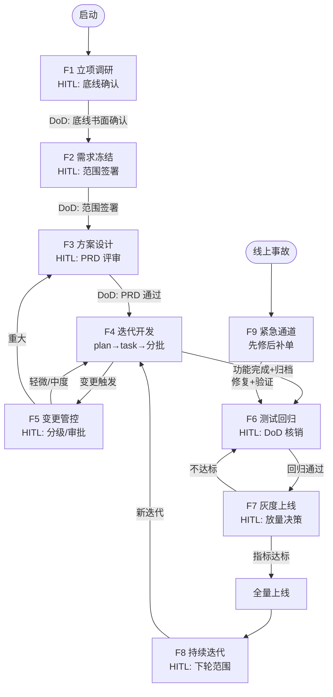

# 【插件需求文档】flowstate — 项目开发全流程规范插件

> 本文档是将《【真实落地版】现代化项目开发全流程》优化重写为**插件需求文档（PRD）**的版本。
> 核心变化：从"流程方法论"升级为"插件要做什么"——明确插件形态、角色分工（含 AI/人分工）、
> 每个功能阶段的输入输出与完成判据、产出物模板字段定义、流程流转判据、紧急通道、度量指标、
> 端到端示例。原流程内容压缩为附录保留。
>
> 状态：草案 v0.2 ｜ 插件命名：**flowstate**（技能前缀 `fst-`）

---

## 一、项目定位

### 1.1 一句话定位

一个引导 AI 编程助手在**需求不全、中途变更、持续迭代**的真实项目中，按"先锁核心底线、边做边补、可控变更、持续校准"流程工作的**项目开发全流程规范插件**。

### 1.2 要解决的核心问题

| # | 痛点 | 现状后果 | 插件要做的 |
|---|------|---------|-----------|
| 1 | 初期需求模糊、细节缺失 | 需求调研一次做不全，方案反复推翻 | 只锁定 3 个核心底线，未知项显式标记为"待确认" |
| 2 | 业务中途改方案、口头加需求 | 工期失控、代码反复重构、项目烂尾 | 需求分层 + 变更分级 + 强制变更流程，杜绝口头需求 |
| 3 | 上线后补规则 | 上线即返工、边界规则缺失 | 灰度试运行 + 持续迭代闭环，承认需求永远补不全 |

### 1.3 插件的形态（交付物）

本插件交付**一组 skills + commands + 产出模板 + 校验 schema + 执行图**，让 AI 助手在项目开发各阶段被触发时：
- **引导式**：按流程询问/记录/产出（如立项访谈、变更评估）
- **模板化**：按固定 schema 生成各阶段产出物（需求分层清单、变更申请单、验收 Checklist 等）
- **可校验**：产出物可被脚本校验完整性（参照 plugin-factory 的 `schemas/` 模式）
- **图编排（Agent Graph）**：全流程是**一张可执行的状态图**（见第七章）——节点=流程环节、边=DoD 流转条件、条件边=变更分级路由、循环=变更回环与迭代闭环、人工闸门（HITL）=必须等人确认的节点、Checkpoint=断点续跑。**图为逻辑蓝图，采用动态软编排**：由 Claude Code / Codex 等 Agent 框架按 skills/commands 动态驱动执行

### 1.4 非目标（明确不做）

- 不做项目管理工具（不替代 Jira/禅道/飞书表格），只产出文档与引导
- 不做具体业务领域的开发流程（不涉及具体技术栈、语言）
- 不做全量需求调研工具——**明确放弃"一次调研完整"的目标**
- 不强制团队采用特定敏捷仪式（无站会/无 sprint 评审强制要求）

---

## 二、目标用户与角色分工

### 2.1 使用者

| 角色 | 在流程中的位置 | 使用方式 |
|------|--------------|---------|
| 项目负责人/技术负责人 | 主使用者 | 启动立项、审批变更、确认排期 |
| 产品/需求方（业务方） | 需求来源 | 提需求、确认范围、验收 |
| 开发者 | 执行者 | 按迭代范围开发、配合变更评估 |
| **AI 助手（插件本体）** | 流程执行引擎 | 记录、引导、生成产出物、提醒、校验 |

### 2.2 AI 与人的分工（关键设计决策）

**AI 自动做（无需人工确认）**：
- 记录需求原文、生成需求分层清单草稿
- 生成变更影响评估草稿（是否改库/重构/影响旧功能）
- 生成各阶段产出物初稿（范围说明书、变更申请单、验收 Checklist）
- 维护需求池、风险清单、技术债清单（增删改查）
- 生成迭代回顾报告、度量统计

**AI 做但必须人工确认**：
- 核心底线冻结（3 条底线是否锁定）
- 迭代范围确认（本轮做什么、不做什么）
- 变更分级判定（轻微/中度/重大）
- 重大变更的暂停与重启
- 灰度→全量的放量决策
- DoD（完成定义）逐项核销

**只允许人做，AI 不得代劳**：
- 业务方口头需求 → 必须由产品归档后才能进入流程（AI 只提醒，不代答）
- 重大变更的最终审批
- 上线决策

### 2.3 触发场景

| 触发词/场景 | 对应流程环节 |
|------------|-------------|
| 新项目启动、需求模糊、"做个 X" | 立项调研 |
| "需求定了""范围确认" | 需求冻结 |
| "这个需求要改""加个功能" | 变更管控 |
| 迭代开始/结束 | 迭代开发/验收 |
| 上线、灰度、试运行 | 灰度上线 |
| 回顾、复盘、下轮规划 | 持续迭代闭环 |

---

## 三、核心概念与术语（统一口径）

| 术语 | 定义 | 关键规则 |
|------|------|---------|
| **核心底线（3 条）** | ①解决什么核心问题 ②目标用户是谁 ③必须上线的基础价值 | 立项时锁定，之后不可模糊 |
| **刚性核心需求** | 首期必须做、不可变更的需求（核心业务流程、核心功能） | 变更 = 重大变更，走审批 |
| **弹性细节需求** | 规则模糊、待定、可延后的需求 | 迭代中补全，不做深度实现 |
| **临时新增需求** | 迭代中冒出的新需求 | 统一进需求池，不插入当前迭代 |
| **需求池** | 所有待定/新增/弹性需求的统一存放处 | 含优先级排序，每轮迭代排期 |
| **变更分级** | 轻微 / 中度 / 重大 三档 | 由 AI 建议 + 人工确认 |
| **DoD（完成定义）** | 迭代交付"做完"的验收标准 | 逐项核销后才算完成 |
| **骨架开发** | 未确认需求只做最小可运行结构，不做细节实现 | 骨架必须能跑冒烟测试 |
| **灰度** | 小流量上线验证 | 达标后才能全量 |
| **迭代** | 固定周期（1~2 周）的交付批次 | 主干先行、细节后置 |

> 术语统一：全文只用"迭代"，不再用"里程碑"；"需求池"为唯一需求暂存区。

---

## 四、功能需求（按流程阶段）

> 每个阶段统一格式：**触发 → 输入 → AI 动作 → 人工动作 → 产出物 → 完成判据（DoD）**

### F1 立项调研（锁定底线）

- **触发**：新项目启动、需求模糊、用户说"做个 X / 帮我想想这个项目"
- **输入**：用户的原始构想（可能只有一句话）
- **AI 动作**：
  - 访谈 3 个核心底线（一次一问，不脑补）
  - 收集已知显性需求，**显式标记未知/模糊场景为「待确认需求」**
  - 产出风险清单（含需求变更风险）
- **人工动作**：确认 3 条底线、确认最小可行立项范围（首期不做什么、待定什么、后续补什么）
- **产出物**：项目目标、已知需求清单、需求待定清单、风险清单
- **完成判据**：3 条底线书面确认 ✅

### F2 需求冻结与分层（防蔓延）

- **触发**：立项完成，进入需求整理
- **AI 动作**：将需求分为刚性核心 / 弹性细节 / 临时新增三层，生成迭代范围说明书草稿
- **人工动作**：书面确认当前迭代交付范围；确认"迭代内新增需求统一走变更流程"
- **产出物**：迭代范围说明书、需求分层清单、需求变更规则
- **完成判据**：范围说明书签署 ✅（未签署不得进入设计）

### F3 方案设计（留拓展）

- **触发**：范围冻结后
- **AI 动作**：
  - 产品侧：主干流程固定冻结；可变细节/特殊场景/自定义规则做**柔性预留**（可配置化、参数化、状态预留）；模糊需求只做占位说明
  - 技术侧：核心表结构定型 + 预留扩展字段/状态枚举；模块化解耦；接口通用化
- **人工动作**：确认主干冻结范围、确认预留策略
- **产出物**：柔性 PRD、可拓展架构方案、数据库基础结构、预留拓展说明
- **完成判据**：柔性 PRD 评审通过 ✅

### F4 迭代开发（小步快跑）

- **触发**：迭代开始（建议 1~2 周一轮）
- **AI 动作**：
  - **先写计划，再细化任务，后写代码**（详见下方"开发执行指引"）：
    1. 写 `docs/plan` 计划（默认落 `.agent-workplace/docs/plan/`）：按大阶段拆分为多个 **phase**，每个 phase 说明"要做什么、为什么做"
    2. 每个 phase 细化任务到 `docs/task`（默认落 `.agent-workplace/docs/task/`）：任务**分批次**，按内容内聚程度和实现顺序排列，保证连贯性与有序性
    3. 按批次逐批实现、逐批验证
  - 只实现本轮已确认、无争议的核心功能
  - 未确认需求只做骨架开发（**骨架必须通过冒烟测试**）
  - 频繁变动的细节逻辑优先配置化
  - 每次代码变更记录原因（可追溯）
  - **按功能开 Git 分支开发**（一个功能/变更单一个分支，详见 F4.2）
- **人工动作**：确认 phase 划分与任务分批（是否连贯、有序）；开发中临时变更 → 走简易变更评估（F5）；迭代末验收
- **产出物**：docs/plan + docs/task + 可运行功能 + 变更记录 + 迭代验收结果（过程态产出物默认落 `.agent-workplace/`，不提交 git；定稿内容写入项目正式 `docs/` 提交，见 `docs/agent-workplace.md`）
- **完成判据**：DoD 全部核销 ✅（功能完成 + 变更测试通过 + 回归通过 + 文档同步 + 变更记录归档）

#### F4.1 开发执行指引（需求 → 方略 → 设计 → 执行）

> 铁律：**先盘点需求，再选方略，后设计，最后执行**；不写 plan 不写码，不分批不动工。
> 开发动作开始前，必须先完成需求盘点、方略选型、plan 与 task 产出。
>
> 存放约定：过程态产物（plan/task/实验脚本）统一放 **`.agent-workplace/`**（不提交 git）；
> 要提交的内容从一开始就写在项目正式目录。详见 `docs/agent-workplace.md`。

**第 0 步：盘点本轮需求 + 选方略（需求驱动，前置）**

> **方略由本轮迭代的需求决定**——不是整个项目需求，而是**本轮要交付/要改动的那部分**：
> 范围说明书排期需求 + 已归档变更单（CR-xxx）+ 需求池排入条目（新需求、新改动就是变更单部分）。

1. **盘点本轮需求**：汇总 REQ-xxx（范围说明书）+ CR-xxx（fst-change 归档变更单）+
   需求池排入条目 → 产出**本轮需求清单**（新功能 / 需求改动 / 缺陷修复 / 技术债偿还分类）
2. **按需求特征选方略**（见下方"三种方略"）：每 phase 一组内聚需求选一种方略
3. **确认方略**：向用户说明"本轮需求长什么样 → 为什么选这个方略"，确认后再设计

**第一步：写 `docs/plan`（计划，按大阶段分 phase + 声明方略）**

- 根据本轮需求清单，按**大阶段**拆分多个 phase，例如：基础层 → 核心流程 → 交互/外围 → 打磨/上线准备
- 每个 phase 必须写清楚三件事：
  - **要做什么**（本 phase 的目标与交付内容，关联需求 id）
  - **为什么做**（业务/技术理由，防止"为做而做"）
  - **方略**（`strategy`：`spec` / `loop` / `graph`，来自第 0 步选型）
- phase 之间体现依赖顺序：前一个 phase 是后一个的基础

**第二步：细化 `docs/task`（任务，分批次 + 按方略组织）**

- 每个 phase 下的任务再**分批次（batch）**，分批依据：
  - **内聚程度**：功能相关、改动同一模块/同一层（如都在数据层、都在 API 层）的任务放同一批，减少上下文切换
  - **实现顺序**：先做前置依赖（建表 → 接口 → 页面），后做上层；同批任务可连续完成、可整体验证
- 分批目标是保证**连贯性和有序性**：批次间有清晰的递进关系，每批完成即可独立验证（编译/冒烟），避免任务零散跳跃
- 按 phase 声明的方略组织任务（见下）

**三种方略（由需求特征决定）**

| 需求特征（本轮需求的形态） | 方略 | 链条 | 组织方式 | 可验证 |
|------|------|------|---------|--------|
| 常规功能开发、验收点清晰 | **spec**（默认） | `phase→task→spec` | 每个任务带**验收标准（acceptance）**，完成 = 验收标准逐项核销 | ✅ 任务完成即验收核销 |
| 目标明确但边界模糊、需反复逼近（修测试、批量迁移、持续排查） | **loop** | `phase→loop` / `phase→task→loop` | 目标循环：完成条件 → 每轮自评 → 达标停止（`state/goal.md`） | ✅ 每轮有验证信号 |
| 依赖复杂、跨模块、可并行（大重构、多变更联动） | **graph** | `phase→graph` / `phase→task→graph` | 任务用 `deps` 标依赖，按拓扑推进、可并行（节点=任务、边=DoD） | ✅ 每节点 DoD 守卫 |

- **spec**：常规开发、每步可验收 → 每个任务必须写清"做到什么算完成"的验收标准，逐项核销后才算完成（取代旧 todo 勾选清单）
- **loop**：目标明确、长跑、反复逼近 → 设定完成条件，每轮只做 bounded 工作，自评达标才停
- **graph**：依赖复杂、可并行、按拓扑推进 → 节点=任务、边=依赖/DoD，无依赖冲突的节点可并行执行，节点失败回退上游
- **简单任务**（一句话能说清 diff）→ 不进方略，直接做，用轻量 todo 清单跟踪

**第三步：按方略实现**

- 一批一验：每批实现后跑一次构建/冒烟，通过才进入下一批
- 批次内遇到未确认细节 → 走 F5 变更流程，不擅自脑补
- 每批结束更新 docs/task 状态，向用户同步进度

#### F4.2 Git 分支开发指引

> 铁律：**一个功能/变更单一个分支，分支干净合并，不污染主干**。
> 现在开发几乎都用 Git 分支做功能开发，本插件把分支规范纳入迭代流程，与变更管控
> （F5）、测试回归（F6）、紧急通道（F9）衔接。

**分支规范**（示例，可配置）：

| 分支 | 命名 | 用途 |
|------|------|------|
| 主干 | `main` / `master` | 只接受合并，不直接开发 |
| 功能分支 | `feat/<变更单id或功能slug>`（如 `feat/CR-001`） | 对应当前批次/变更单的功能开发 |
| 修复分支 | `fix/<bugslug>` | 缺陷修复（配合 F9 紧急通道） |

**开发流程**：

1. **开分支**：从主干按功能/变更单开分支（一个变更单一个分支，对应 F5 归档的 CR-xxx）
2. **分支内按批次实现**：每个批次完成后提交，提交信息带变更单 id（如 `CR-001: 实现导出`），保持可追溯
3. **分支内验证**：分支完成该功能所有批次后，跑变更针对性测试 + 核心回归（F6）
4. **合并回主干**：通过后合并（PR/MR 评审或直接合并，按团队规则）；合并前确保文档已同步（PRD/设计文档）
5. **合后清理**：删除已合并分支，更新 docs/task 状态

**与流程的衔接**：

- 一个变更单（CR-xxx）= 一个功能分支，分支名/提交信息带变更单 id
- **未归档的变更不得开新分支**（对应 F5 强制流程"未归档不得改动代码"）
- 紧急修复（F9）走 `fix/` 分支：先修后补单，合并后 24h 内补录变更单
- 分支合并前必须通过 F6（变更针对性测试 + 核心回归），未通过不得合并
- 骨架开发（未确认需求）也在功能分支上进行，随该功能合并或留在分支内等待确认

### F5 需求变更管控（核心功能，必做）

- **触发**：任何新需求/需求改动（口头、IM、邮件）
- **AI 动作**：
  - 立即记录需求原文（杜绝口头需求无痕消失）
  - 按规则建议变更分级：
    - 轻微（文案、状态微调）→ 当前迭代直接修复
    - 中度（规则微调、次要细节）→ 记录存档、评估工时、本轮收尾或下轮实现
    - 重大（核心流程改动、结构重构）→ **暂停当前开发**，重新评估范围/工期/成本，二次评审后重启
  - 生成变更影响评估草稿（是否改库、是否重构、是否影响旧功能）
  - 生成变更申请单
- **人工动作**：确认变更分级；重大变更审批；排期确认
- **产出物**：变更申请单、影响评估、变更记录归档
- **完成判据**：变更单归档 + 已排期 ✅（未归档不得改动代码）
- **强制流程**：业务提变更 → 产品记录归档 → 技术评估影响 → 团队对齐排期 → 落地开发 → 同步更新 PRD/设计文档

### F6 测试与回归（适配变更）

- **触发**：迭代开发完成 / 任何变更落地后
- **AI 动作**：
  - 变更针对性测试：针对每次改动点 + 关联影响点
  - 高频回归测试：每次迭代、每次变更后回归核心主干流程
  - 骨架冒烟测试：未确认需求的骨架代码**必须通过冒烟**（修正原文档"待定需求不测试"的歧义）
  - 待定需求不做深度细节测试、不纳入交付验收
- **人工动作**：确认测试结果、确认缺陷清单处理
- **产出物**：测试报告、回归结果、缺陷清单
- **完成判据**：核心回归通过 + 变更点测试通过 ✅

### F7 灰度上线与试运行

- **触发**：迭代验收通过，准备上线
- **AI 动作**：
  - 生成灰度方案（小流量比例、监控指标、回滚预案）
  - 汇总灰度期反馈，标记遗漏需求
- **人工动作**：灰度放量决策、全量上线决策（见六、流转判据）
- **产出物**：灰度方案、反馈汇总、遗漏需求清单
- **完成判据**：灰度指标达标 → 全量 ✅

### F8 持续迭代闭环

- **触发**：迭代结束 / 上线后 / 用户要求回顾
- **AI 动作**：
  - 汇总本期度量（完成率、变更次数、返工率、需求池积压）
  - 生成迭代回顾报告（完成/未完成/变更统计/风险/技术债）
  - 需求池优先级排序建议
- **人工动作**：确认下轮迭代范围
- **产出物**：回顾报告、下轮迭代范围、需求池排序
- **完成判据**：回顾完成 + 下轮范围确定 ✅

### F9 紧急通道（Hotfix，修正原文档缺口）

- **触发**：线上事故 / 阻断性问题
- **规则**：不适用常规变更流程，走直通车——**先修后补单**：
  1. 立即评估影响面（AI 协助，5 分钟内）
  2. 修复 + 针对性验证
  3. 上线后 **24 小时内补录变更申请单 + 影响评估 + 复盘**
- **AI 动作**：协助影响面评估、生成 hotfix 记录、事后补单提醒
- **完成判据**：线上恢复 + 变更单补录 ✅

---

## 五、产出物模板与字段定义（插件要生成的内容）

> 每个产出物对应一个 schema（JSON），供插件校验与复用（参照 plugin-factory `schemas/prd.schema.json` 模式）。

### 5.1 需求分层清单（F1/F2）

| 字段 | 类型 | 说明 |
|------|------|------|
| id | string | 需求编号（REQ-001） |
| title | string | 需求标题 |
| source | string | 来源（业务方/产品/用户反馈/技术自驱） |
| layer | enum | 刚性核心 / 弹性细节 / 临时新增 / 待确认 |
| priority | enum | P0 / P1 / P2 / P3 |
| status | enum | 待确认 / 已冻结 / 开发中 / 已完成 / 已排期 / 已拒绝 |
| known_gaps | string[] | 已知的模糊点、未知场景（显式记录） |
| iteration | string | 排入的迭代号（可为空） |

### 5.2 迭代范围说明书（F2）

| 字段 | 类型 | 说明 |
|------|------|------|
| iteration | string | 迭代号 |
| in_scope | string[] | 本轮交付需求 id 列表 |
| out_scope | string[] | 明确不做（含原因） |
| frozen_core | string[] | 冻结的刚性核心需求 id |
| change_rule | string | 迭代内新增需求统一走变更流程 |
| signed_by | string | 签署人 / 日期 |

### 5.3 变更申请单（F5/F9）

| 字段 | 类型 | 说明 |
|------|------|------|
| id | string | 变更编号（CR-001） |
| req_original | string | 需求原文（逐字记录，防口头需求） |
| raised_by | string | 提出人 / 渠道（口头/IM/邮件） |
| level | enum | 轻微 / 中度 / 重大 / 紧急 |
| impact | object | 是否改库 / 是否重构 / 影响旧功能 / 工时估算 / 返工量 |
| decision | enum | 接受 / 延后 / 拒绝 / 紧急直通 |
| approved_by | string | 审批人（重大变更必填） |
| iteration | string | 排入迭代 |
| archived_at | string | 归档时间 |

### 5.4 迭代验收 Checklist（DoD，F4/F6）

| 项 | 是否必须 | 说明 |
|----|---------|------|
| 功能完成（含骨架冒烟通过） | ✅ | 未确认需求至少跑通骨架 |
| 变更针对性测试通过 | ✅ | 改动点 + 关联影响点 |
| 核心主干回归通过 | ✅ | 每次迭代/变更后 |
| 文档同步（PRD/设计文档） | ✅ | 变更后必更新 |
| 变更记录归档 | ✅ | 无归档 = 未完成 |
| 待定需求不纳入交付验收 | — | 未确认需求不测深度细节 |

### 5.5 风险清单（F1/F8）

| 字段 | 类型 | 说明 |
|------|------|------|
| id | string | 风险编号 |
| description | string | 风险描述 |
| category | enum | 需求变更 / 技术 / 排期 / 资源 |
| likelihood | enum | 高/中/低 |
| impact | enum | 高/中/低 |
| mitigation | string | 缓解措施 |
| owner | string | 责任人 |
| status | enum | 开放 / 缓解中 / 已关闭 |

### 5.6 技术债清单（F4/F8）

| 字段 | 类型 | 说明 |
|------|------|------|
| id | string | 债编号 |
| description | string | 妥协实现说明（骨架/配置化/硬编码） |
| reason | string | 为何妥协（等待需求确认等） |
| repay_iteration | string | 计划偿还迭代 |
| status | enum | 待偿还 / 偿还中 / 已偿还 |

### 5.7 迭代回顾报告（F8）

| 部分 | 内容 |
|------|------|
| 交付统计 | 计划 vs 完成、DoD 核销率 |
| 变更统计 | 变更次数、分级分布、紧急次数 |
| 度量 | 完成率、返工率、需求池积压、技术债增减 |
| 风险与技术债 | 当前清单快照 |
| 下轮建议 | 需求池排序、范围建议 |

### 5.8 开发计划 docs/plan（F4.1）

> 计划文件，按大阶段拆分为多个 phase，每个 phase 说明"要做什么、为什么做"。

| 字段 | 类型 | 说明 |
|------|------|------|
| iteration | string | 迭代号 |
| phase | object[] | phase 列表（见下表） |

**phase 对象**：

| 字段 | 类型 | 说明 |
|------|------|------|
| id | string | 阶段编号（P1 / P2 / …） |
| name | string | 阶段名（如"基础层""核心流程"） |
| goal | string | **要做什么**（本阶段目标与交付内容） |
| rationale | string | **为什么做**（业务/技术理由） |
| strategy | enum | 执行方略：`spec`（默认）/ `loop` / `graph` |
| req_ids | string[] | 关联需求 id |
| deps | string[] | 前置 phase id |
| status | enum | 规划中 / 进行中 / 已完成 |

### 5.9 任务清单 docs/task（F4.1）

> 任务文件，每个 phase 下的任务分批次排列，按内聚程度和实现顺序保证连贯有序。

| 字段 | 类型 | 说明 |
|------|------|------|
| phase_id | string | 所属阶段（P1 / P2 / …） |
| batch_id | string | 批次编号（B1 / B2 / …，同一 phase 内从 1 递增） |
| task | object[] | 任务列表（见下表） |

**task 对象**：

| 字段 | 类型 | 说明 |
|------|------|------|
| id | string | 任务编号（P1-B1-T01） |
| title | string | 任务标题 |
| desc | string | 任务内容描述 |
| cohesion | string | 内聚依据（与同批任务的共同模块/层级） |
| acceptance | string[] | **验收标准**（spec 方略必填）：可验证断言，逐项核销 |
| deps | string[] | 前置任务 id（graph 方略的依赖边） |
| status | enum | 待开始 / 进行中 / 已完成 / 已阻塞 |

**分批规则（内聚 + 顺序）**：

- 同批任务改动同一模块/同一层（数据层、API 层、页面层），内聚度高、上下文切换少
- 先做前置依赖（建表 → 接口 → 页面），后做上层，批次间递进有序
- 每批完成即可独立验证（编译/冒烟），避免任务零散跳跃

---

## 六、流程流转判据（阶段如何衔接）

| 从 | 到 | 流转条件 |
|----|----|---------|
| 立项（F1） | 需求冻结（F2） | 3 条底线书面确认 |
| 需求冻结（F2） | 方案设计（F3） | 范围说明书签署 |
| 方案设计（F3） | 迭代开发（F4） | 柔性 PRD 评审通过 |
| 迭代开发（F4） | 测试（F6） | 功能完成 + 变更归档 |
| 测试（F6） | 灰度上线（F7） | 核心回归通过 + 变更点测试通过 |
| 灰度（F7） | 全量 | 灰度指标达标 |
| 全量/迭代末 | 持续迭代（F8） | 回顾完成 + 下轮范围确定 |

**灰度→全量门槛（示例指标，可配置）**：
- 核心功能通过率 ≥ 99%
- 崩溃率 / 错误率低于阈值（如 < 0.5%）
- 无 P0 阻断缺陷
- 灰度期反馈已归入需求池，无紧急遗漏

---

## 七、Agent 执行图（图编排内化）

> 本插件的流程不是一份线性文档，而是一张**可执行的状态图（State Graph）**。AI 助手按图遍历执行：节点是流程环节，边是流转条件，循环/分支/人工闸门显式建模。**图为逻辑蓝图，采用动态软编排**——由 Claude Code / Codex 等 Agent 框架按 skills/commands 驱动执行（节点、条件边、循环、Checkpoint、HITL 均为图上的设计概念）。

### 7.1 节点（Node）= 流程环节

F1~F9 每个功能阶段是一个节点，节点持有自己的输入、产出物与 DoD：

| 节点 | 对应功能 | 产出物（schema） |
|------|---------|----------------|
| N1 立项调研 | F1 | 项目目标、已知/待定需求清单、风险清单 |
| N2 需求冻结 | F2 | 迭代范围说明书、需求分层清单 |
| N3 方案设计 | F3 | 柔性 PRD、可拓展架构方案 |
| N4 迭代开发 | F4 | docs/plan、docs/task、可运行功能 |
| N5 变更管控 | F5 | 变更申请单、影响评估 |
| N6 测试回归 | F6 | 测试报告、回归结果、缺陷清单 |
| N7 灰度上线 | F7 | 灰度方案、反馈汇总 |
| N8 持续迭代 | F8 | 回顾报告、下轮范围 |
| N9 紧急通道 | F9 | hotfix 记录、补录变更单 |

### 7.2 边（Edge）= DoD 判据

边就是流转判据（见第六章），**DoD 核销是边上的守卫条件（guard）**，未核销不能沿边前进：

- N1 → N2：3 条底线书面确认
- N2 → N3：范围说明书签署
- N3 → N4：柔性 PRD 评审通过
- N4 → N6：功能完成 + 变更归档
- N6 → N7：核心回归通过 + 变更点测试通过
- N7 → 全量：灰度指标达标

### 7.3 条件边（Conditional Edge）= 路由决策

图与线性流程的关键区别——按条件分叉：

- **N4 → N5（变更回环）**：开发中任何新需求/改动，无条件进入变更节点
- **N5 → N4 / N3**：轻微/中度 → 回 N4 继续开发；重大 → 回 N3 重新评估设计（暂停重启）
- **N7 → 全量 / 回滚**：指标达标 → 全量；不达标 → 回滚并回 N6

### 7.4 循环（Loop）= 迭代闭环

- **变更回环**：N4 → N5 → N4，迭代内需求变更反复评估，直到收敛
- **迭代闭环**：N8 → N4，持续迭代是外层大循环
- **Hotfix 短路**：任意节点 → N9 → N6，先修后补单

### 7.5 人工闸门（HITL）= 必须暂停等人

对应 2.2 节"AI 做但必须人工确认"，图执行到这些节点**强制暂停**，等用户输入后才继续：

- 底线冻结确认（N1 出口）
- 迭代范围确认（N2 出口）
- 变更分级确认（N5）
- 重大变更审批（N5）
- 灰度放量 / 全量决策（N7）
- DoD 核销（N6）

### 7.6 检查点（Checkpoint）= 断点续跑

- 每个节点完成即保存状态（产出物 + 流转记录），默认落 `.agent-workplace/state/`
- 中途打断可从**断点恢复**，不重跑已完成节点
- 对应 F4.1"每批实现后更新 docs/task 状态"

### 7.7 并行（Parallel）

- 多张变更单互不依赖时可**并行评估影响**
- 需求池排序与风险扫描可并行执行

### 7.8 完整执行图

### 7.9 图编排带来的能力（对比纯线性流程）

| 能力 | 纯线性文档 | Agent 执行图 |
|------|-----------|-------------|
| 变更回环 | 文字描述，靠人脑 | 显式边，Agent 框架按图动态路由 |
| 中断恢复 | 从头再走 | Checkpoint 断点续跑 |
| 人工闸门 | 靠自觉 | 节点强制暂停等待 |
| 并行 | 不支持 | 支持并行分支 |
| 可视化/调试 | 无 | mermaid 图可直接查看执行路径 |

---

## 八、度量指标（如何证明流程有效）

| 指标 | 定义 | 数据来源 | 健康基准（示例） |
|------|------|---------|----------------|
| 迭代完成率 | 计划需求数 / 实际完成数 | 需求分层清单 + DoD | ≥ 80% |
| 需求变更次数 | 每迭代变更单数量 | 变更申请单 | 记录趋势，不设死值 |
| 返工率 | 返工工时 / 总工时 | 变更影响评估 | < 20% |
| 需求池积压 | 未排期需求数量 | 需求池 | 持续下降或稳定 |
| DoD 核销率 | 核销项 / 必检项 | 验收 Checklist | 100% |
| 技术债增减 | 本期新增 / 偿还 | 技术债清单 | 净变化 ≤ 0 |

> 度量目的不是考核，是让团队在回顾会上看清"变更是否失控、流程是否有效"。

---

## 九、端到端示例（需求验证用）

**场景**：某 ToB 政企项目"工单管理系统"，客户说："我们想做一个工单系统，具体细节还没想好，先做起来。"

### 走一遍流程

1. **F1 立项**：AI 访谈 3 底线 → ①解决工单流转与跟踪 ②客户内部支持团队 ③基础价值=工单创建/指派/状态跟踪。已知需求 5 条，标记待确认 8 条（含权限体系、SLA、通知方式）→ 客户确认底线 ✅
2. **F2 冻结**：分层——刚性：工单 CRUD + 指派 + 状态机；弹性：SLA 提醒、报表；临时：客户口头加的"多租户"→ 进需求池。范围说明书签署 ✅
3. **F3 设计**：状态机预留扩展状态枚举；通知模块做成可配置（邮件/SMS/站内信，后续再加）；权限做占位。柔性 PRD 通过 ✅
4. **F4 迭代 1**（2 周）：做刚性核心。开发中客户加需求"工单要能导出 Excel"→ 走 F5。
5. **F5 变更**：AI 记录原文、判定中度（不影响核心流程、不改库，工时 0.5d）→ 本轮收尾实现。变更单 CR-001 归档 ✅
6. **F6 测试**：变更针对性测试（导出）+ 核心回归（工单状态流转）通过 ✅
7. **F7 灰度**：10% 流量上线，指标达标（通过率 99.5%，无 P0）→ 全量 ✅
8. **F8 回顾**：完成率 90%，变更 3 次（2 中度 1 轻微），返工率 5%，需求池积压 12 条（含多租户）→ 下轮排期 SLA + 报表。

**示例要点**：展示了"需求不全也能启动、变更可控不失控、骨架先行、灰度兜底"的完整闭环。

---

## 十、非功能需求

| 类别 | 需求 |
|------|------|
| 语言 | 技能描述用英文（触发用），正文用中文；README 双语（对齐 plugin-factory 约定） |
| 兼容性 | 多 harness：Claude Code / pi / opencode / oh-my-pi（对齐 plugin-factory 的 scaffold 目标） |
| 可追溯性 | 每次需求变更、代码变更都留痕（谁/何时/为何/影响），产出物可归档 |
| 校验性 | 产出物有 schema，可被脚本校验完整性（对齐 plugin-factory `scripts/verify.mjs` 模式） |
| 轻量化 | 不强制团队采用完整敏捷仪式；流程步骤按需触发，不搞重流程 |
| 可配置 | 灰度指标阈值、迭代周期、变更分级规则可配置 |
| 无侵入 | 不修改用户代码；只在流程文档/产出物层面工作 |

---

## 十一、后续落地事项

1. **插件命名**：已定 **flowstate**（中文展示名可作"流程状态机/心流"），技能前缀 `fst-`
2. **技能拆分方案（已定）**：按 `fst-` 前缀拆分 4 个技能——`fst-init`（N1~N3 立项/冻结/设计）、
   `fst-change`（N5+N9 变更管控/紧急通道）、`fst-review`（N6~N7 测试/灰度验收）、
   `fst-iterate`（N4+N8 迭代开发/持续迭代闭环，含 F4.2 Git 分支适配）。
   详细映射、产出物归属、关联最佳实践见 **`docs/skill-split.md`**（权威拆分依据）
3. **schema 落地**：5.1~5.9 的 JSON Schema 文件（放 `schemas/` 目录）
4. **与 plugin-factory 的关系**：独立插件（放仓库根目录），注册进 marketplace.json
5. **编排方式（已定）**：**拒绝代码硬编排，采用动态软编排**——第七章执行图是
   **逻辑蓝图**，由 Claude Code / Codex 等 Agent 框架按 skills/commands 动态
   软编排执行；Checkpoint 落在产出物文件（`.agent-workplace/state/`），
   HITL 由 Agent 框架的交互机制承载

---

## 附录：原流程文档（压缩保留）

### 原核心原则

不追求一次性需求完备，只守住核心底线；所有变更可追溯、可评估、不烂尾；小步快跑、动态补全。

### 原九阶段链路（精简）

模糊构想 + 粗调研（留未知项）→ 锁定核心范围、分层需求 → 柔性可拓展设计（防重构）→ 短迭代小步开发 → 可控需求变更管控 → 变更针对性测试 + 回归 → 灰度上线试运行 → 收集遗漏需求 → 持续迭代补全

### 与原文档的核心差异（为什么 PRD 更清楚）

- 明确了**插件形态**（skills + commands + 模板 + schema），而非停留在方法论
- 明确了**AI 与人的分工**（AI 自动做 / AI 做但人确认 / 只允许人做）
- 每个阶段补齐了**触发、输入、产出物、完成判据（DoD）**
- 修正了两处矛盾：核心需求变更 = 重大变更走审批；骨架代码必须过冒烟测试
- 补齐了原文档缺失的：紧急通道（Hotfix）、阶段流转判据、度量指标、端到端示例
- 每个产出物补齐了**字段定义**，可直接转为 schema
- 补齐了**开发执行指引**：开发前先写 `docs/plan`（按大阶段分 phase，说明要做什么/为什么做），再细化 `docs/task`（任务分批次，按内聚程度与实现顺序排列，保证连贯有序）
- 内化了 **Agent 图编排（Graph Engineering）**：流程从线性文档升级为**可执行状态图**（节点/边/条件边/循环/HITL/Checkpoint/并行/紧急短路），作为逻辑蓝图由 Agent 框架动态软编排驱动执行
