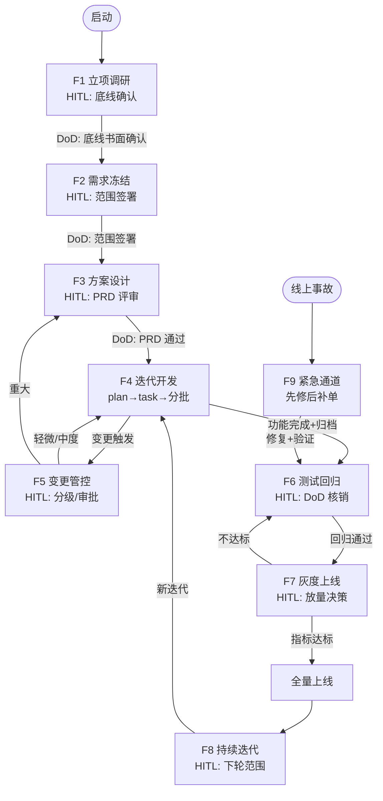

# 流程框架（Agent 执行图，N1~N9）

> **单点维护约定**：本文件是 **flowstate 专属流程框架的唯一权威**——节点 / 边 / 条件边 / 循环 /
> 人工闸门 / 检查点 / 并行 / 短路的全部细节**只在此维护**。
> `docs/PRD.md` §七、`README.md`「工作流程」、各 `SKILL.md` 只做**引用或摘要，不复制本表**；
> 改动节点/边/闸门一律改这里，其它位置同步勾稽（必要时由测试校验）。
>
> 技能↔节点的**所有权**不是本文件的职责，见 [`references/skill-graph.md`](../references/skill-graph.md)。
> 本文件定「流程怎么走」（框架）；`agent-modes/` 定「这一步怎么做得更好」（模式），两者解耦。

## 两层架构（先看清自己在哪一层）

| 层 | 是什么 | 变化频率 | 位置 |
|----|--------|---------|------|
| **流程框架（本文件）** | 整套开发流程的结构：节点、边、循环、闸门 | 慢——符合现代开发哲学与现实条件，不随单一问题变化 | **本文件（唯一权威）** |
| **操作模式（mode）** | 解决单一问题的方法：lightweight todo / spec / loop / graph | 快——随经验不断更新、可插拔、框架无关 | `references/agent-modes/*.md` |

**关系**：流程的**每个节点**可以选用不同操作模式去执行——
例如开发节点可用 Spec / Loop / Graph 模式，立项节点可用访谈澄清 + 需求分层。
框架定"流程怎么走"，模式定"这一步怎么做得更好"；两者解耦，互不绑架。

---

## 执行图结构

```
节点（Node）   = 流程环节：F1~F9 → N1~N9
边（Edge）     = 流转条件：DoD 核销是边上的守卫（guard）
条件边         = 变更分级路由（轻微/中度→回开发，重大→回设计）
循环（Loop）   = 变更回环（N4→N5→N4）、迭代闭环（N8→N4）
人工闸门(HITL) = 必须暂停等人确认：底线冻结/范围签署/分级确认/重大审批/放量决策/DoD 核销
检查点(Checkpoint) = 断点续跑：`state/checkpoint.json`
并行（Parallel）   = 多变更单并行评估（`state/artifacts.json` 注册）
短路（Shortcut）   = Hotfix 直通车：任意节点 → N9 → N6
```

## 节点（Node）= 流程环节

节点持有自己的输入、产出物与 DoD（退出条件）。技能归属见 `skill-graph.md`，产出物 schema 定义见 `schemas/`。

| 节点 | 对应功能 | 产出物 | Node schema |
|------|---------|--------|-------------|
| N1 立项调研 | F1 | 项目目标、已知/待定需求清单、风险清单 | `requirements-layer` / `risk-list` |
| N2 需求冻结 | F2 | 迭代范围说明书、需求分层清单 | `scope` / `requirements-layer` |
| N3 方案设计 | F3 | 柔性 PRD、可拓展架构方案 | — |
| N4 迭代开发 | F4 | docs/plan、docs/task、可运行功能、技术债 | `plan` / `task` / `tech-debt` |
| N5 变更管控 | F5 | 变更申请单、影响评估 | `change-request` |
| N6 测试回归 | F6 | 测试报告、回归结果、缺陷清单、DoD | `dod-checklist` |
| N7 灰度上线 | F7 | 灰度方案、反馈汇总 | — |
| N8 持续迭代 | F8 | 回顾报告、下轮范围 | `retrospective` |
| N9 紧急通道 | F9 | hotfix 记录、补录变更单 | `change-request` |

## 边（Edge）= DoD 判据

边就是流转判据，**DoD 核销是边上的守卫条件（guard）**，未核销不能沿边前进：

- N1 → N2：3 条底线书面确认
- N2 → N3：范围说明书签署
- N3 → N4：柔性 PRD 评审通过
- N4 → N6：功能完成 + 变更归档
- N6 → N7：核心回归通过 + 变更点测试通过
- N7 → 全量：灰度指标达标

## 条件边（Conditional Edge）= 路由决策

图与线性流程的关键区别——按条件分叉：

- **N4 → N5（变更回环）**：开发中任何新需求/改动，无条件进入变更节点
- **N5 → N4 / N3**：轻微/中度 → 回 N4 继续开发；重大 → 回 N3 重新评估设计（暂停重启）
- **N7 → 全量 / 回滚**：指标达标 → 全量；不达标 → 回滚并回 N6

## 循环（Loop）= 迭代闭环

- **变更回环**：N4 → N5 → N4，迭代内需求变更反复评估，直到收敛
- **迭代闭环**：N8 → N4，持续迭代是外层大循环
- **Hotfix 短路**：任意节点 → N9 → N6，先修后补单

## 人工闸门（HITL）= 必须暂停等人

对应 PRD §2.2 "AI 做但必须人工确认"，图执行到这些节点**强制暂停**，等用户输入后才继续：

- 底线冻结确认（N1 出口）
- 迭代范围确认（N2 出口）
- 变更分级确认（N5）
- 重大变更审批（N5）
- 灰度放量 / 全量决策（N7）
- DoD 核销（N6）

## 检查点（Checkpoint）= 断点续跑

- 每个节点完成即保存状态（产出物 + 流转记录），默认落 `.agent-workplace/state/`
- 中途打断可从**断点恢复**，不重跑已完成节点
- 对应功能 F4.1 "每批实现后更新 docs/task 状态"

## 并行（Parallel）

- 多张变更单互不依赖时可**并行评估影响**
- 需求池排序与风险扫描可并行执行

## 工作区如何承载图

| 图元素 | 落地位置 | 说明 |
|--------|---------|------|
| 当前节点/phase/batch | `state/checkpoint.json` | 每批完成即更新，断点续跑 |
| 目标与自我评估 | `state/goal.md` | Loop 策略（目标循环）与图的迭代闭环协同 |
| 产物注册 | `state/artifacts.json` | 跨节点追踪产出物 |
| 过程文档 | `docs/` | 各节点的产出物（plan/task/spec/requirements/decisions） |
| 实验验证 | `scripts/` + `scratch/` | 节点的"怎么做才对"验证 |

## 完整执行图



## 铁律（图执行约束）

1. **未核销不能沿边前进**：DoD 未核销，不得进入下一节点
2. **闸门必须等人**：HITL 节点强制暂停，AI 不得越权代做"只允许人做"的决策
3. **变更必须走边**：任何新需求/改动先进 N5（变更管控），记录原文、分级、评估后才动代码
4. **断点必存**：每节点/每批完成写 `state/checkpoint.json`；N9 Hotfix 开始时也必须先写紧急 checkpoint
5. **骨架必过冒烟**：未确认需求只做骨架，但骨架必须通过冒烟测试

## 与操作模式的关系（解耦要点）

- 选择模式**不改变框架**：换一种操作模式只是换"这一步的解法"，图的节点/边不变
- 更新模式**不推翻流程**：`agent-modes/` 加新模式（如新出的 TDD 模式）不影响流程骨架
- 框架演进**缓慢且受控**：改流程结构需走项目 ADR（如 `docs/ADR-0002-agent-graph.md`），不是随手调整

## 维护规则

- 节点/边/条件边/循环/闸门/检查点/并行/短路**只在本文档维护**，不复制进 PRD / README / SKILL
- 改动节点语义后，勾稽 `skill-graph.md` 的节点所有权与 `schemas/` 映射是否需要同步
- 改动边/闸门后，勾稽各 `SKILL.md` 的编排叙述是否为摘要（不是复制）