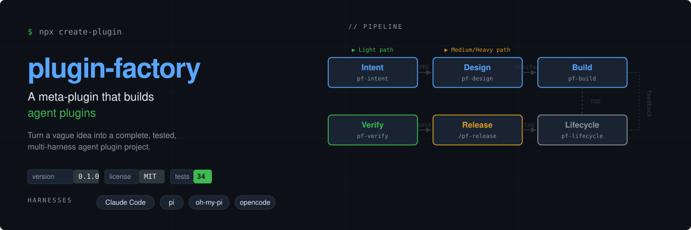

<p align="center">
  
</p>

**plugin-factory** is a meta-plugin that guides your AI coding agent to create **new, standalone agent plugin projects** from nothing but your intent, goals, and scenarios.

You tell the agent *what you want*; it drives the rest: intent interview → PRD → design → TDD build (delegated to Anthropic's **skill-creator**) → verification → release → lifecycle analysis.

> 中文说明见 [README.zh-CN.md](README.zh-CN.md)

---

## How it works

<p align="center">
  
</p>

| Phase | Skill / Command | Deliverable |
|-------|-----------------|-------------|
| **Intent** | `pf-intent` | One-page PRD + complexity gate (Light → skip design, Medium/Heavy → full path) |
| **Design** | `pf-design` | Component manifest + per-harness manifest specs + ADR (Heavy) |
| **Build** | `pf-build` | Standalone plugin project; skills via skill-creator (TDD loop: test cases → implement → eval) |
| **Verify** | `pf-verify` | Structural & compliance audit (3-layer engine: structure → harness → orchestration) |
| **Release** | `/pf-release` | SemVer version, CHANGELOG, bilingual README, install scripts |
| **Lifecycle** | `pf-lifecycle` | Pure-structural analysis → recommend split / merge / reorganize / port / retire |

---

## Quick start

**1. Install** for your AI coding agent:

| Harness | Install |
|---------|---------|
| Claude Code | `/plugin marketplace add morning-start/agent-plugins` then `/plugin install plugin-factory@agent-plugins` |
| pi | `pi install git:github.com/morning-start/plugin-factory` |
| oh-my-pi (omp) | `omp plugin install git:github.com/morning-start/plugin-factory` |
| opencode | Follow `.opencode/INSTALL.md` |

**2. Create a plugin.** Run `/pf-new` (Claude Code) or tell your agent "I want a plugin that…".

**3. Answer 8 questions.** The agent interviews you one at a time: core functionality, goal, scenarios, triggers, boundaries, platforms, complexity signals, language preference.

**4. Sign off the PRD.** The agent writes a one-page PRD. You confirm it. Done — the agent drives the rest.

**5. Get a standalone plugin project.** New directory, bilingual README, per-harness manifests, multi-shell hooks, install scripts, TDD test stubs, and lifecycle probes.

---

## Supported harnesses

All four harnesses are verified by the dogfood smoke test (`npm run smoke`). A harness is only advertised when its manifest, bootstrap adapter, skill discovery path, and smoke check are present (T1 contract).

| Harness | Skill discovery | Hooks | Commands |
|---------|----------------|-------|----------|
| **Claude Code** | `skills/` | `.sh` + `.ps1` pairs via `hooks.json` | `commands/*.md` |
| **pi** | `package.json` → `pi.skills` | `.pi/extensions/<prefix>-bootstrap.ts` | `registerCommand` |
| **oh-my-pi (omp)** | `package.json` → `omp` / `pi` fields | `.pi/extensions/<prefix>-bootstrap.ts` | `registerCommand` |
| **opencode** | `.opencode/skills/` (auto-copied by scaffold) | `.opencode/plugins/*.ts` | `.opencode/command/*.md` |

---

## Repository structure

```
plugin-factory/
├── .claude-plugin/plugin.json    # Claude Code plugin manifest
├── .pi/extensions/               # pi / oh-my-pi bootstrap extension
├── .opencode/                    # opencode config + INSTALL.md
├── skills/                       # pf-* workflow sub-skills (canonical location)
├── commands/                     # /pf-* slash commands
├── hooks/                        # session-start bootstrap (multi-shell)
├── references/                   # shared design docs (adapters, plugin model, lifecycle matrix)
├── scripts/                      # scaffold / verify / lifecycle / version / release (Node core + shell wrappers)
├── templates/                    # shared + harnesses scaffold templates
├── docs/                         # ADRs, glossary, optimization reports
└── tests/                        # contract + smoke tests (34 passing)
```

---

## Design principles

| Principle | Description |
|-----------|-------------|
| **Intent first** | No PRD, no work. The signed-off PRD is the only ticket into build. |
| **Delegate, never reimplement** | Skill authoring is delegated to Anthropic's **skill-creator** — plugin-factory never hand-writes skills. |
| **Standard-driven rendering** | Skills authored once to the Agent Skills standard; per-harness adapters handle only the differences. |
| **TDD methodology** | Every skill follows Red-Green-Refactor: write test cases → implement → verify. |
| **CSO descriptions** | Skill descriptions are pure triggers (Condition-Situation-Outcome): "Use when…", never workflow. |
| **Lifecycle metadata** | Every skill has `metadata.lifecycle` (status / version / created / updated). |
| **Quality is mechanical** | Every advertised harness, skill, command, hook, and manifest must pass `npm run verify`. |
| **Release safety** | Preparation is separated from publication. The release gate checks version sync, evidence, and a clean worktree — tagging and pushing are explicit user actions. |

---

## Verification & quality

```bash
npm run validate        # structural audit (Agent Skills standard)
npm run validate:ps     # same, PowerShell wrapper
npm test                # full test suite (34 tests, all pass)
npm run lifecycle       # lifecycle probe audit
npm run release:check   # release gate (version sync, CHANGELOG, clean worktree)
```

---

## License

[MIT](LICENSE)