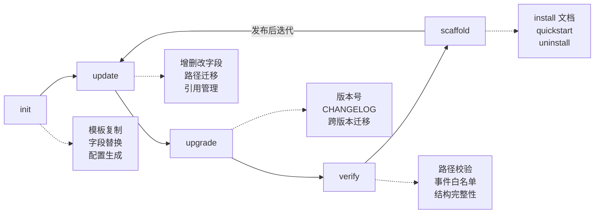

# harnesses — harness 规范 + 生命周期工具

每个 harness 独立文件夹，包含**规范文档**和**生命周期工具**。

## 插件生命周期



## 目录结构

```
harnesses/
├── claude-code/
│   ├── plugin.md        # 插件格式规范
│   ├── hooks.md         # hooks 规范
│   ├── adapters.md      # 适配器规范
│   ├── README.md        # 描述与约束
│   ├── init.mjs         # 初始化
│   ├── update.mjs       # 更新
│   ├── upgrade.mjs      # 升级
│   ├── verify.mjs       # 校验
│   ├── scaffold.mjs     # 脚手架
│   └── templates/       # 脚手架模板（.tmpl）
├── opencode/            # 同上结构
├── pi/                  # pi 和 oh-my-pi 共用工具
├── codex/
├── oh-my-pi/            # 独立规范，复用 pi 工具
└── index.mjs            # 注册表
```

## 支持的 harness

| harness | 规范文档 | 工具模块 |
|---------|----------|----------|
| **claude-code** | plugin.md, hooks.md, adapters.md | init/update/upgrade/verify/scaffold |
| **opencode** | plugin.md, hooks.md, adapters.md | init/update/upgrade/verify/scaffold |
| **pi** | plugin.md, hooks.md, adapters.md | init/update/upgrade/verify/scaffold |
| **oh-my-pi** | plugin.md, adapters.md | 复用 pi 模块 |
| **codex** | plugin.md, adapters.md | init/update/upgrade/verify/scaffold |

## 路由层

| 根级脚本 | 调用 |
|----------|------|
| `validate-harness.mjs` | `harnesses/<h>/verify.mjs` |
| `scaffold/scaffold.mjs` | `harnesses/<h>/scaffold.mjs` |
| `verify/verify.mjs` | 集成所有 `harnesses/<h>/verify.mjs` |

## API

```js
import { getHarness, getLifecycleModule, listHarnesses } from "./index.mjs";

// 获取完整 harness 模块
const cc = getHarness("claude-code");
await cc.init.init(target, values);
const findings = await cc.verify.validate(root);

// 获取特定生命周期模块
const verify = getLifecycleModule("claude-code", "verify");
```

## 新增 harness

1. 创建 `harnesses/<name>/` 文件夹
2. 添加规范文档（plugin.md, hooks.md, adapters.md）
3. 实现生命周期模块（init.mjs, update.mjs, upgrade.mjs, verify.mjs, scaffold.mjs）
4. 在 `index.mjs` 注册
