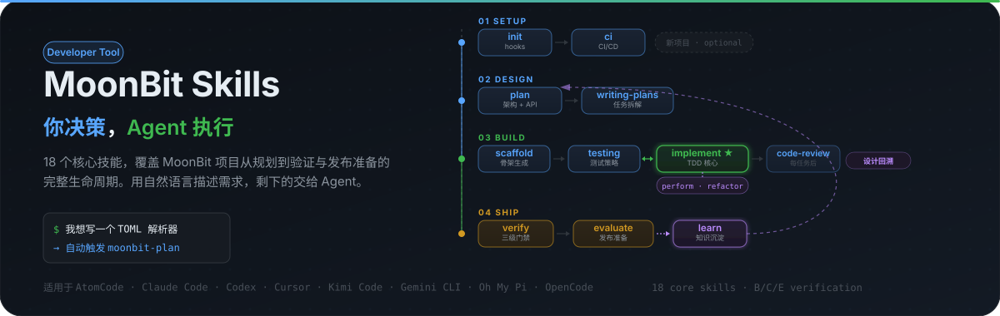

# MoonBit Skills

面向 MoonBit 项目的 **Agent 技能套件与质量门禁**：需求澄清、骨架生成、测试设计与验证由 Agent 承担，交付是否“完成”由新鲜验证证据决定。

<p align="center">
  
</p>

它不是 MoonBit 运行库，也不替代 MoonBit 编译器；它约束的是 Agent 如何理解需求、规划结构、设计测试并证明结果。**决策由你做，执行由 Agent 做，完成由新鲜证据证明。**

**能力边界**：本插件只承载 **MoonBit 专属**能力（设计、骨架生成、测试设计、验证、CI 基础设施）。实现、任务拆解、代码审查、发布、部署、性能、重构、git 操作、文档、安全等通用流程不属于本插件，由用户或外部流程插件（如 flowstate/fst）编排，本插件可与它们协同使用、不接管其管线状态。

---

## 快速开始

<p align="center">
  
</p>

### 安装

OMP 是最直接的安装方式（Git 直装，无需 marketplace）：

```bash
omp plugin install https://github.com/morning-start/moonbit-skills.git
```

> 本插件不在任何平台的官方插件市场发布，无法直接搜索下载。Claude Code / Cursor / Codex / Kimi Code 等平台需**先添加自定义 Marketplace（指向 morning-start/agent-plugins）**再安装，具体见下方「[支持的平台](#支持的平台)」。

准备：`moon` 工具链（必需）与 Git；可选 `moon-audit` 用于增强安全审计。

### 第一句请求

```text
我想写一个只支持 native 的 TOML 解析器，先帮我设计 API 和测试策略。
```

典型路由：

```text
moonbit-plan → moonbit-scaffold → moonbit-testing → moonbit-verify
                                                    ↑ moonbit-ci（如需要）
```

不需要记住技能名：bootstrap 入口会根据意图路由；平台支持时也可直接使用 `/skill:<name>` 或技能菜单。

| 你可以这样说 | 入口技能 |
|---|---|
| “我要做一个 MoonBit CLI” | `moonbit-plan` |
| “按这个设计生成项目骨架” | `moonbit-scaffold` |
| “如何组织测试，补上 invalid 和 edge 场景” | `moonbit-testing` |
| “帮我检查格式、类型和测试” | `moonbit-verify` |
| “帮我搭建 CI 和本地 hooks” | `moonbit-ci` |

---

## 工作管线

<p align="center">
  
</p>

管线是推荐路径，不是必须走完的固定脚本：

```text
Plan → [Spike] → Scaffold → Testing ↔ Verify
                              (CI：随时可调)
```

- 已有项目通常跳过 `scaffold`；不需要 CI 可跳过 `moonbit-ci`。
- `testing` 与 `verify` 双向协作；测试设计不接管实现代码。
- 发现 API 不可测试、架构假设错误或设计缺陷时，回到 `plan` 重设计。
- **实现与部署不在管线内**：设计批准、骨架、测试与验证完成后，实现类工作由用户或外部流程插件接手。

---

## 5 个核心技能

| 技能 | 作用 |
|---|---|
| `moonbit-plan` | 澄清需求（目标/场景/客户/边界/维护五问），选择项目类型，确定架构、目标平台与 API；宏观设计 + 模块划分 + 规则承载 + 可维护性设计 |
| `moonbit-scaffold` | 按已批准设计**动态生成**项目骨架（按模块组织目录），不依赖预置模板、不覆盖已有用户文件 |
| `moonbit-testing` | 设计测试策略、组织测试文件、决定测试时机（先行 vs 后补）、补充 valid/invalid/edge 场景 |
| `moonbit-verify` | 执行基础、Custom、增强三级验证门禁；支持按模块/任务验证子集，产出结构化 JSON 证据 |
| `moonbit-ci` | 建立 GitHub Actions、commit message 校验、本地 hooks 与分支保护基础设施 |

`using-moonbit-skills` 是 bootstrap 路由入口（SessionStart 自动注入），不计入上述 5 个核心技能。

---

## 三级验证门禁

`moonbit-verify` 按项目类型选择检查路径。基础检查是所有 MoonBit 项目的共同底线。

| 层级 | 作用 | 典型检查 | 阻断 |
|---|---|---|:---:|
| **B：基础** | 格式、类型、功能、工作区状态 | `moon fmt --check`、`moon check --warn-list +73`、`moon test` | 是 |
| **C：Custom** | 项目类型专属验证 | `moon run .`、`moon info`、临时 consumer 编译 | 是 |
| **E：增强** | 为发布和决策补充信号 | 跨平台、安全、性能、API 深度、CI、文档 | 否 |

项目类型差异：

- `cli/main`：额外 `moon run .` 并确认 stdout 非空。
- `lib/parser/async/ffi/wasm`：额外进行包结构与临时 consumer 编译验证。
- `ffi`、`wasm`：不按普通 MoonBit `pub` API 做稳定性检查。

完整门禁定义见 [`skills/verify/SKILL.md`](./skills/verify/SKILL.md) 和 [`references/orchestration.md`](./references/orchestration.md)。

---

## 支持的平台

<p align="center">
  
</p>

技能内容统一位于 `skills/`；不同平台通过原生 skill 发现、SessionStart 注入、插件 manifest 或平台 hooks 接入。

<details>
<summary>各平台安装方式</summary>

> 本插件**不在官方插件市场发布**。Claude Code / Cursor / Codex / Kimi Code 均需**先添加自定义 Marketplace（源指向 morning-start/agent-plugins）**，再从该源安装 `moonbit-skills`。

| 平台 | 安装方式 |
|---|---|
| Oh My Pi (OMP) | `omp plugin install https://github.com/morning-start/moonbit-skills.git` |
| AtomCode | `/plugin marketplace add morning-start/agent-plugins`，再安装 `moonbit-skills` |
| Claude Code | `/plugin marketplace add morning-start/agent-plugins`，再 `/plugin install moonbit-skills@agent-plugins` |
| Cursor | 添加自定义 Marketplace 后，在聊天中 `/add-plugin moonbit-skills` |
| Codex CLI / App | 添加自定义 Marketplace 后，在 `/plugins` 中搜索安装 `moonbit-skills` |
| Kimi Code | 添加自定义 Marketplace 后，从市场安装 `moonbit-skills` |
| OpenCode | 使用 `.opencode/opencode.json` 的 instructions 与 plugin 配置（本地文件引用） |

</details>

Hook 事件能力因平台而异：Claude/Kimi 可接入 Git 与完成前门禁，Codex/Cursor 以编辑后的轻量验证为主；任何平台都仍需显式运行 `moonbit-verify` 才能形成完整交付证据。OMP/Pi 通过 `package.json` 的 `omp.extensions` / `pi.extensions` 注册扩展。

### 仓库结构

```text
skills/                    5 个核心技能 + using-moonbit-skills 路由入口
hooks/                     SessionStart、post-tool、Git hooks（Bash only）
commands/                  平台可调用的命令入口
references/                命令、惯用法、项目类型、错误与测试参考
scripts/                   元数据与仓库一致性检查（Node.js）
schemas/                   moonbit-verify 验证工件 JSON Schema
.github/workflows/         CI 配置
```

关键入口：[`skills/using-moonbit-skills/SKILL.md`](./skills/using-moonbit-skills/SKILL.md)（路由）、[`references/orchestration.md`](./references/orchestration.md)（编排规则）、[`plugin.json`](./plugin.json) + [`package.json`](./package.json)（插件元数据）。

---

## 常见问题

<p align="center">
  
</p>

### 必须按顺序使用所有技能吗？

不需要。管线是推荐路径。已有项目可以直接从 `plan`、`testing` 或 `verify` 开始；只有需求或架构变化时才回到 `plan`。

### 我不是 MoonBit 专家，也能用吗？

可以。先用自然语言描述目标和约束，`moonbit-plan` 会询问项目类型、目标平台和 API 决策；后续技能把决定落实为骨架、测试策略和验证证据。

### Agent 会修改我的代码吗？

取决于技能。`plan`、`verify` 默认以设计或报告为主；`scaffold`、`ci` 会在职责范围内写入文件（骨架、hooks、CI 配置）。**实现类代码由用户或外部流程插件编写，本插件不承载实现流程。**

### Windows 支持如何？

安装与技能使用不依赖 Unix shell。hooks 只提供 Bash（sh）版本，Windows 下经 Git Bash 或 WSL 运行。修改仓库自身后建议运行检查：

```bash
node scripts/run-repo-checks.mjs --allow-working-tree
node scripts/check-plugin-metadata.mjs
node scripts/check-pipeline-consistency.mjs
```

Verify 产生 JSON 证据后，用 `node scripts/validate-verification.mjs --file <artifact.json>` 校验。

---

## 许可证

MIT。详见 [`LICENSE`](./LICENSE)（如发行包未包含该文件，以仓库许可证声明为准）。
